# 3D Graphics Programming

## From empty project to hello triangle

Vitalijs Komasilovs


--v--

## Digital Content Creation

<div class="r-stack r-stretch">
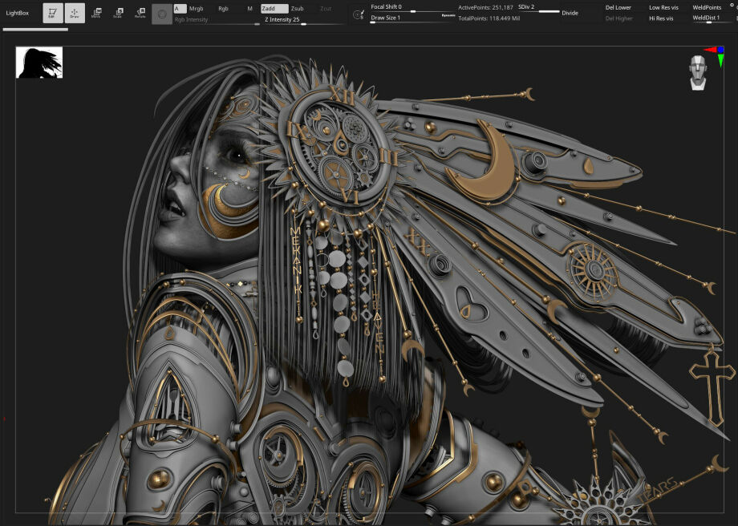
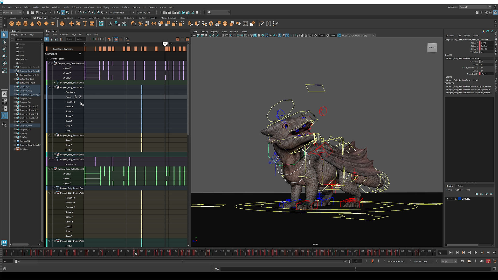
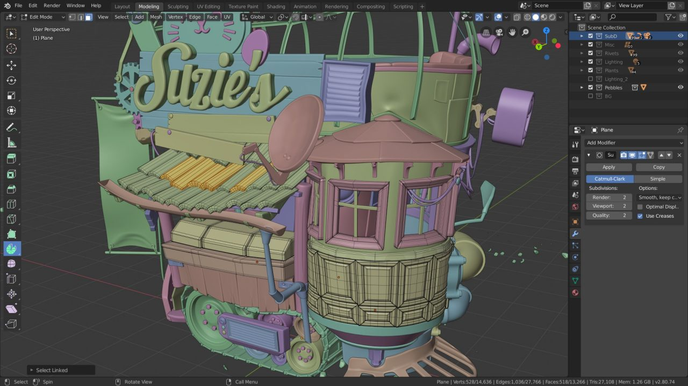
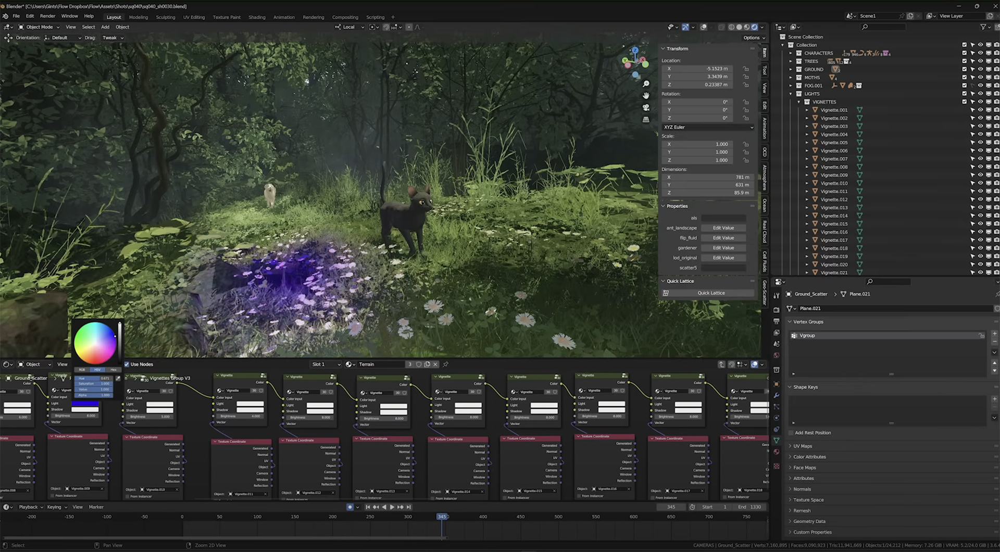
</div>

Notes:
- https://80.lv/articles/check-out-this-mind-blowing-hard-surface-3d-character-sculpt-made-in-zbrush
- https://www.autodesk.com/products/maya/features
- https://www.blender.org/
- https://www.cined.com/the-making-of-flow-a-journey-of-self-learning-and-courage/

--v--

## Computer-Aided Design

<div class="r-stack r-stretch">
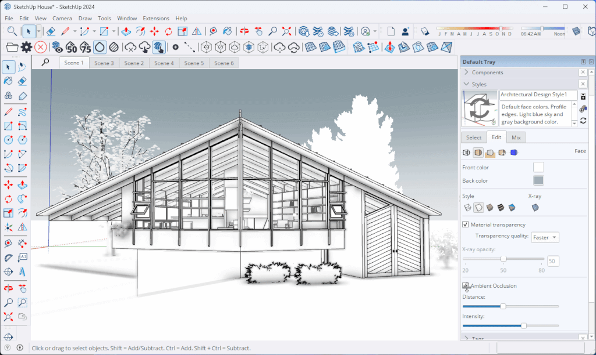
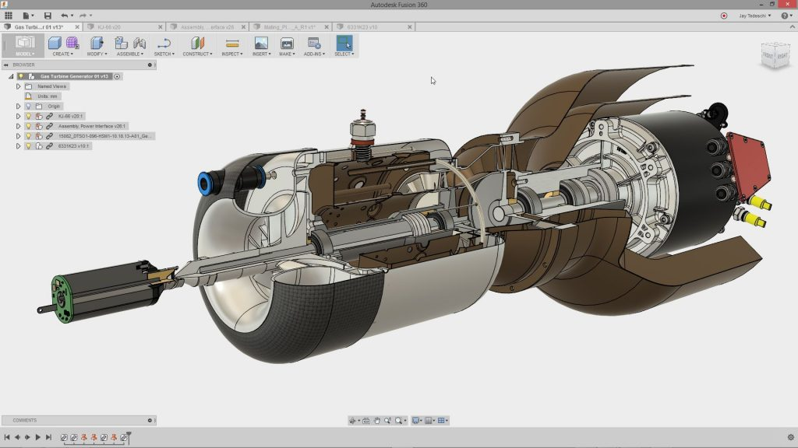
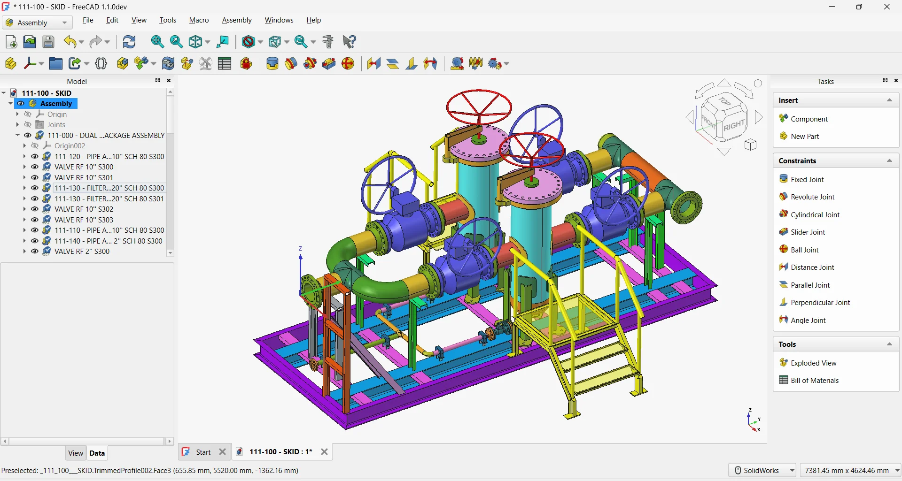
</div>

Notes: 
- https://www.blender3darchitect.com/sketchup/sketchup-pro-2024-released-how-to-download/
- https://bitfab.io/blog/fusion-360-3d-printing/
- https://www.reddit.com/r/FreeCAD/comments/1nadauj/what_did_you_design_first_on_freecad/

--v-- 

## Scientific applications

<div class="r-stack r-stretch">
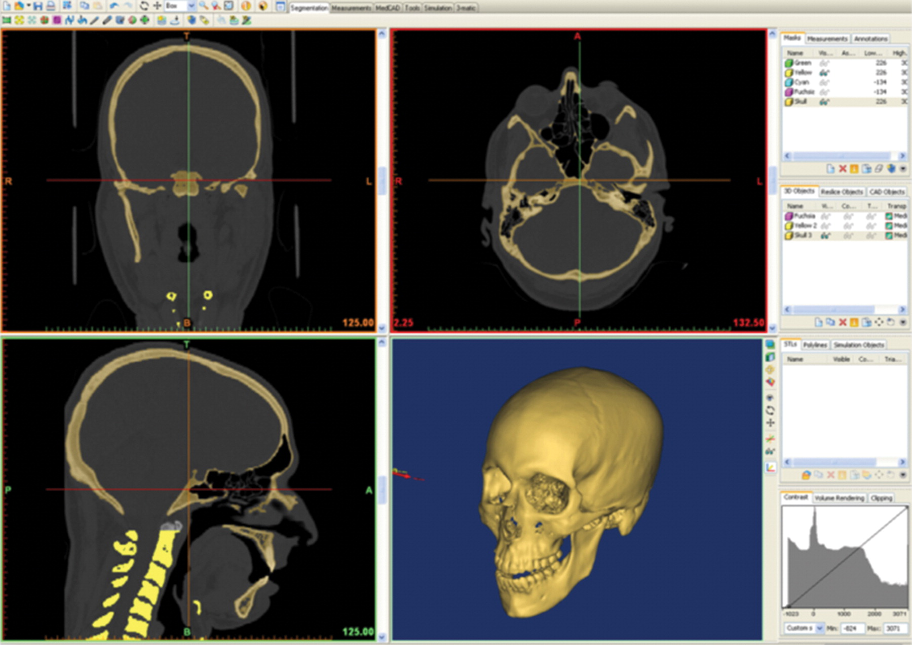
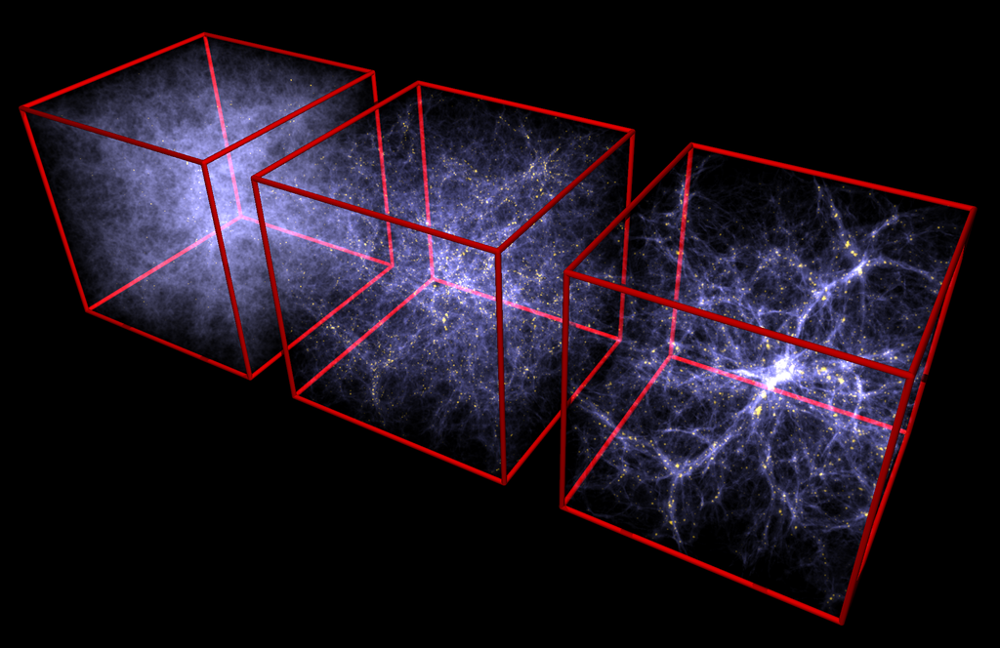
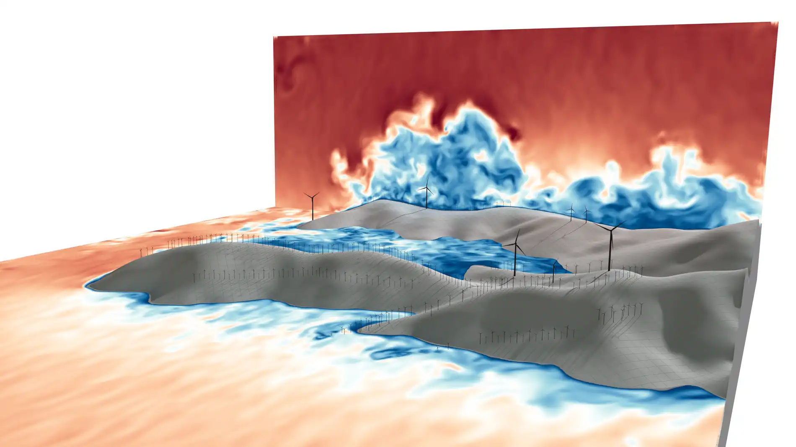
</div>

Notes:
- https://pubs.rsna.org/doi/abs/10.1148/rg.2015140320
- https://rheologic.net/services/wind-turbine-positioning/
- https://wwwmpa.mpa-garching.mpg.de/galform/data_vis/

--v--

## Game engines

<div class="r-stack r-stretch">


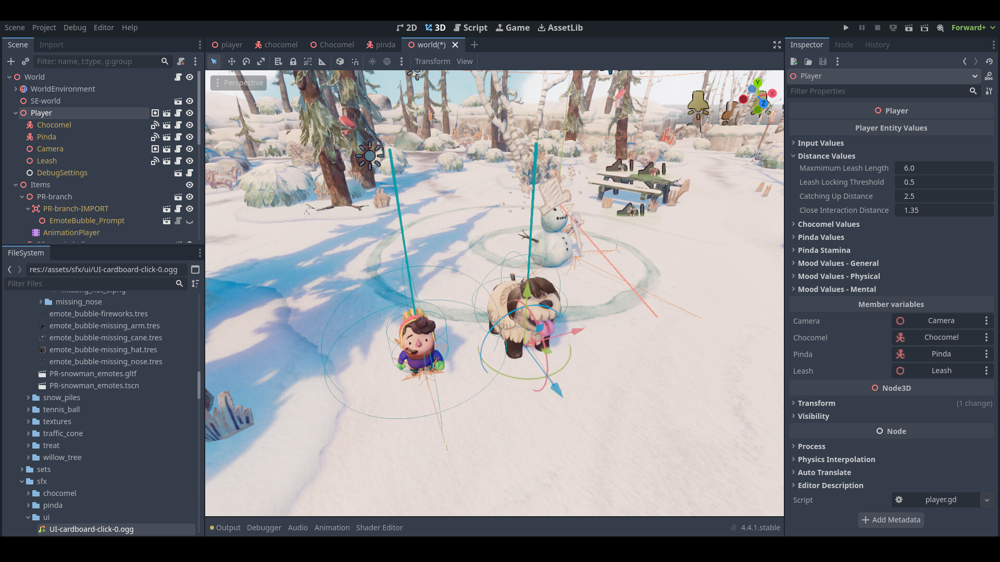
</div>

Notes:
- https://unity.com/blog/industry-customer-success-stories-2025-round-up
- https://www.unrealengine.com/en-US/blog/unreal-engine-5-1-is-now-available
- https://store.steampowered.com/app/3833380/DOGWALK__Supporter_Pack/

--v--

## Video games

<div class="r-stack r-stretch">
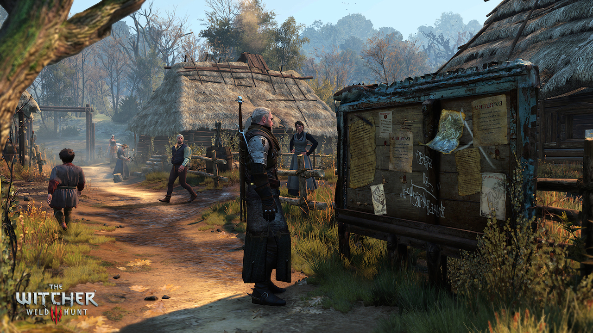

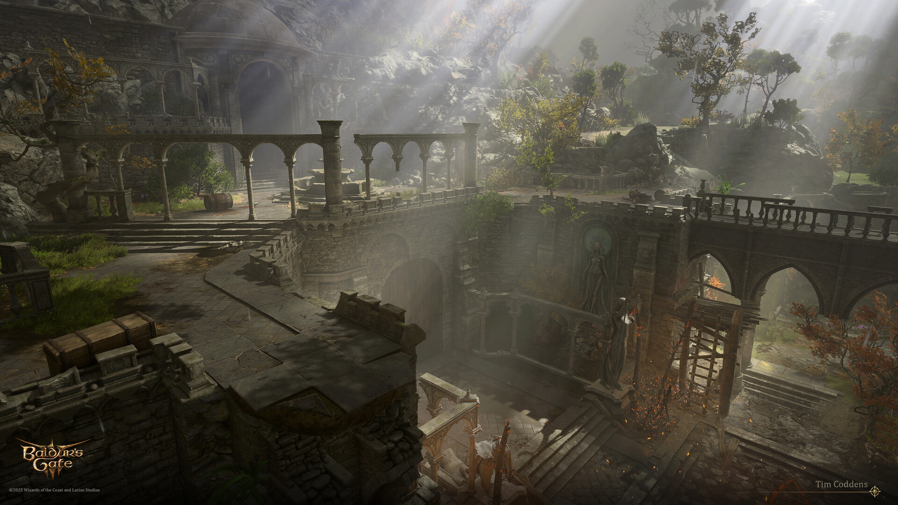
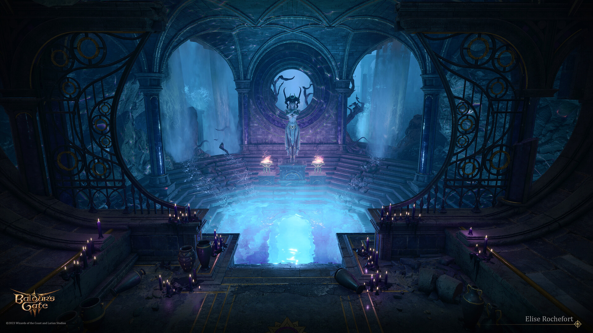

</div>

Notes:
- https://gamingbolt.com/new-witcher-3-wild-hunt-screenshots-promise-an-exciting-epic
- https://www.artstation.com/artwork/5vRvwz
- https://www.artstation.com/artwork/29Km5B
--s--

## Idea of seminars

- Learn 3D graphics programming starting *from scratch*.
- Explain general *principles and reasoning*, instead of providing only working source code.

Notes: 
- Understand what is happening behind the scenes in "other" 3D software.

- Use online resources, but update/reorganize them for better clarity.

--v--

OpenGL

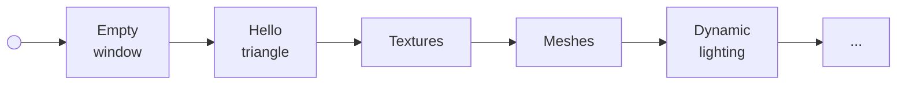
```mermaid
graph LR

start(( )) 
  --> window[Empty<br>window] 
  --> hello[Hello<br>triangle] 
  --> Textures
  --> Meshes
  --> lighting[Dynamic<br>lighting]
  --> etc[...]
```

Vulkan

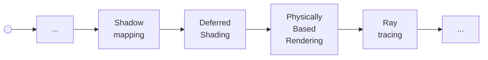
```mermaid
graph LR

start(( )) 
  --> same[...]
  --> shadows[Shadow<br>mapping]
  --> deferred[Deferred<br>Shading]
  --> prb[Physically<br>Based<br>Rendering]
  --> rays[Ray<br>tracing]
  --> etc[...]
```

Notes:
- Learn 3D graphics basics in OpenGL.
- Then switch to Vulkan, repeat the same basics
and continue with more interesting topics.

--v--

## Used sources

- https://learnopengl.com/
- https://vulkan-tutorial.com/ 
- https://vkguide.dev/
- https://howtovulkan.com/

--s--

## Rendering process

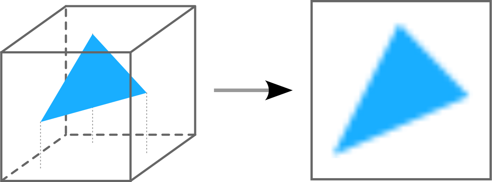

Notes: 
Represent 3D world as 2D image (colored pixels) and maybe show it on screen.

--v--

## Naive approach

```c++
for (int x = 0; x < image.width; x++) {
  for (int y = 0; y < image.height; y++) {
    image[x, y] = getPixelColor(x, y);
  }
}
```

Notes:
- `getPixelColor` implements some sort of rendering algorithm.
- Simplistic, stylized, cartoon shading, photorealistic, ray tracing, etc.

--v--

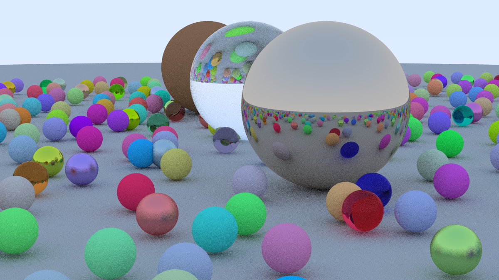
<!-- .element class="r-stretch" -->

Notes:
Simulates light's physical behavior (ray tracing)

--v--

--cols--


Render time: ~15 minutes 
<!-- .element class="fragment" -->

--c--

| Resolution    | Megapixels |
| ------------------: | ---: |
| HD (1280x720)       | 0.92 |
| Full HD (1920x1080) | 2.07 |
| Quad HD (2560x1440) | 3.69 |
| 4K UHD (3840x2160)  | 8.29 |

--cols--

Notes:
Modern resolutions, huge amounts of processing

--v--

## Real time rendering

--cols--

- Interactive user experience
- Higher level primitives
- Hardware acceleration

--c--

| FPS | Time  |
| --: | ----: |
|  60 | ~16ms |
| 144 | ~7ms  |

--cols--

Notes:
- We aim for interactive user experience
- Dedicated hardware is needed - GPUs

--s--

## Graphics Processing Unit

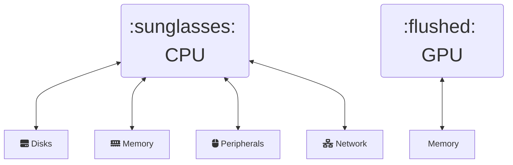
```mermaid
graph TD;
cpu(:sunglasses: CPU)
cpu <---> Disks["fa:fa-hdd Disks"]
cpu <---> Memory["fa:fa-memory Memory"]
cpu <---> Peripherals["fa:fa-mouse Peripherals"]
cpu <---> Network["fa:fa-network-wired Network"]

gpu(:flushed: GPU)
gpu <---> gMemory["fa:fa-square-binary Memory"]

classDef large font-size: 36
class cpu large;
class gpu large;
```
<!-- .element class="full-width" -->

Notes:
- CPU is universal processing unit, works with other devices, 
  features interrupts, complex flows, etc.
- GPU is specialized for graphics/compute pipelines, works with bytes (memory).
- Can be integrated with main CPU (e.g. laptops)
- CPU: 4-16 cores, GPU: 4-16k cores

--v--

## Graphics pipeline

```mermaid
---
config:
  themeVariables:
    edgeLabelBackground: 'transparent'
---
graph LR;

buffer 
  ==> input 
  ==> vertex 
  ==> raster 
  ==> fragment 
  ==> color 
  ==> framebuffer

buffer@{shape: text, label: "Input buffer<br>(bytes)"}
input@{img: "img/graphics_pipeline_input.svg", label: "Input assembler", constraint: "on", h: 200}
vertex@{img: "img/graphics_pipeline_vertex.svg", label: "Vertex shader", constraint: "on", h: 200}
raster@{img: "img/graphics_pipeline_raster.svg", label: "Rasterization", constraint: "on", h: 200}
fragment@{img: "img/graphics_pipeline_fragment.svg", label: "Fragment shader", constraint: "on", h: 200}
color@{img: "img/graphics_pipeline_color.svg", label: "Color blending", constraint: "on", h: 200}
framebuffer@{shape: text, label: "Framebuffer<br>(bytes)"}

classDef fixed stroke:green;
classDef programmable stroke:orange;

class input,raster,color fixed;
class vertex,fragment programmable;

```
<!-- .element class="full-width" -->

Notes:
- Simplified view, modern pipelines are more complex.
- Sequence of operations, transform inputs (vertices, textures) to  the pixels.
- Input assembler extracts raw vertex data from buffers.
- Vertex shader runs for every vertex (usually applies transforms).
- Rasterization brakes primitive into fragments.
- Fragment shader runs for every fragment (usually determines its color).
- Color blending mixes fragments for one pixel.  

--v--

## Graphics pipeline (actual)

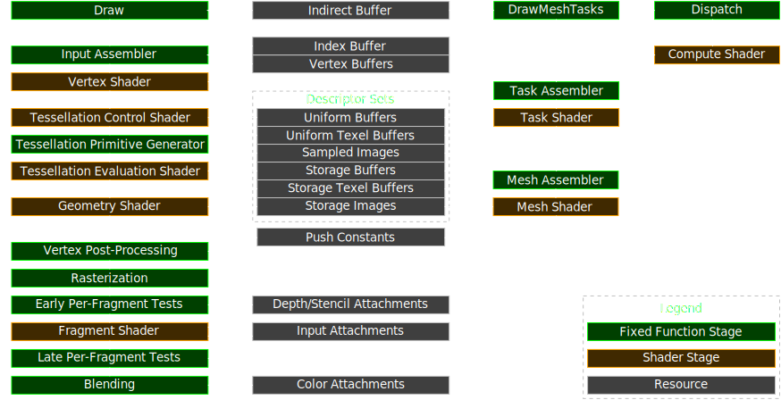

--v--

## High level components

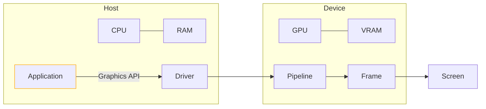
```mermaid
flowchart LR

subgraph host[Host]
  cpu[CPU]
  ram[RAM]

  app[Application]
  drv[Driver]
end

subgraph dev[Device]
  gpu[GPU]
  vram[VRAM]
  pipe[Pipeline] --> frame[Frame]
end

cpu --- ram
gpu --- vram
app -- Graphics API ---> drv
drv ---> pipe
frame --> Screen

style app stroke:orange;

```
<!-- .element class="full-width" -->

Notes:
- Async architecture similar to *client-server*
- Host: computer itself with OS and application
- Device: dedicated board or logical component (e.g. integrated GPU in laptop)

--v--

## Graphics APIs

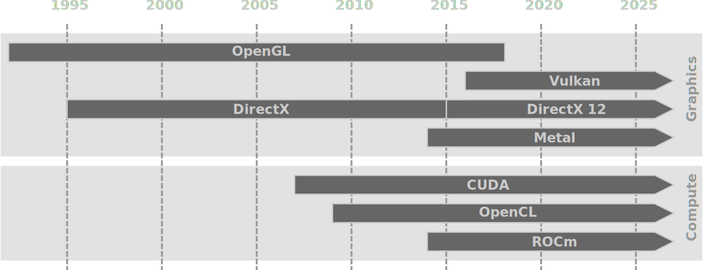

Notes:
- Started in 1990s with proprietary device specific APIs.
- OpenGL: cross-language, cross-platform API for graphics.
- Vulkan: a ground-up redesign of API, not backwards compatible with OpenGL.
- DirectX: Microsoft's take on graphics API. 12th version offers low-level API.
- Metal: Apple's graphics API
- There are also APIs dedicated for compute.

--s--

## My long title

```c++
int main() {
  try {
    runOpenGLDemo();
  } catch (std::exception &ex) {
    fmt::println("EXCEPTION: {}", ex.what());
    return EXIT_FAILURE;
  }
  return EXIT_SUCCESS;
}
```
