# 3D Graphics Programming

## From empty project to hello triangle

Vitalijs Komasilovs


--v--

## Digital Content Creation

<div class="r-stack r-stretch">


</div>

Notes:
- https://80.lv/articles/check-out-this-mind-blowing-hard-surface-3d-character-sculpt-made-in-zbrush
- https://www.autodesk.com/products/maya/features
- https://www.blender.org/
- https://www.cined.com/the-making-of-flow-a-journey-of-self-learning-and-courage/

--v--

## Computer-Aided Design

<div class="r-stack r-stretch">


</div>

Notes: 
- https://www.blender3darchitect.com/sketchup/sketchup-pro-2024-released-how-to-download/
- https://bitfab.io/blog/fusion-360-3d-printing/
- https://www.reddit.com/r/FreeCAD/comments/1nadauj/what_did_you_design_first_on_freecad/

--v-- 

## Scientific applications

<div class="r-stack r-stretch">


</div>

Notes:
- https://pubs.rsna.org/doi/abs/10.1148/rg.2015140320
- https://rheologic.net/services/wind-turbine-positioning/
- https://wwwmpa.mpa-garching.mpg.de/galform/data_vis/

--v--

## Game engines

<div class="r-stack r-stretch">


</div>

Notes:
- https://unity.com/blog/industry-customer-success-stories-2025-round-up
- https://www.unrealengine.com/en-US/blog/unreal-engine-5-1-is-now-available
- https://store.steampowered.com/app/3833380/DOGWALK__Supporter_Pack/

--v--

## Video games

<div class="r-stack r-stretch">


</div>

Notes:
- https://gamingbolt.com/new-witcher-3-wild-hunt-screenshots-promise-an-exciting-epic
- https://www.artstation.com/artwork/5vRvwz
- https://www.artstation.com/artwork/29Km5B
--s--

## Idea of seminars

- Learn 3D graphics programming starting *from scratch*.
- Explain general *principles and reasoning*, instead of providing only working source code.

Notes: 
- Understand what is happening behind the scenes in "other" 3D software.

- Use online resources, but update/reorganize them for better clarity.

--v--

OpenGL

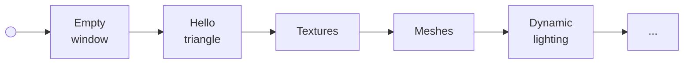

Vulkan

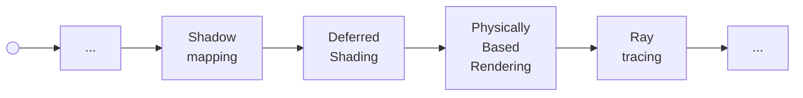

Notes:
- Learn 3D graphics basics in OpenGL.
- Then switch to Vulkan, repeat the same basics
and continue with more interesting topics.

--v--

## Used sources

- https://learnopengl.com/
- https://vulkan-tutorial.com/ 
- https://vkguide.dev/
- https://howtovulkan.com/

--s--

## Rendering process


Notes: 
Represent 3D world as 2D image (colored pixels) and maybe show it on screen.

--v--

## Naive approach

```c++
for (int x = 0; x < image.width; x++) {
  for (int y = 0; y < image.height; y++) {
    image[x, y] = getPixelColor(x, y);
  }
}
```

Notes:
- `getPixelColor` implements some sort of rendering algorithm.
- Simplistic, stylized, cartoon shading, photorealistic, ray tracing, etc.

--v--


<!-- .element class="r-stretch" -->

Notes:
Simulates light's physical behavior (ray tracing)

--v--

--cols--


Render time: ~15 minutes 
<!-- .element class="fragment" -->

--c--

| Resolution    | Megapixels |
| ------------------: | ---: |
| HD (1280x720)       | 0.92 |
| Full HD (1920x1080) | 2.07 |
| Quad HD (2560x1440) | 3.69 |
| 4K UHD (3840x2160)  | 8.29 |

--cols--

Notes:
Modern resolutions, huge amounts of processing

--v--

## Real time rendering

--cols--

- Interactive user experience
- Higher level primitives
- Hardware acceleration

--c--

| FPS | Time  |
| --: | ----: |
|  60 | ~16ms |
| 144 | ~7ms  |

--cols--

Notes:
- We aim for interactive user experience
- Dedicated hardware is needed - GPUs

--s--

## Graphics Processing Unit

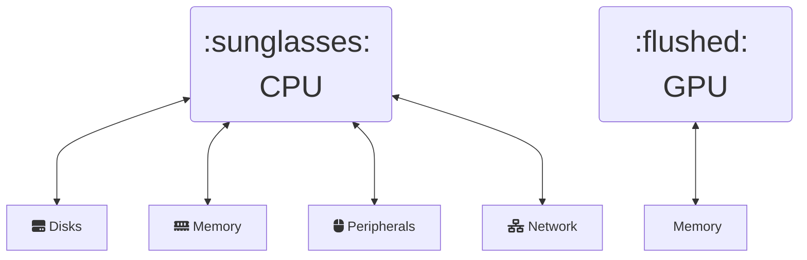
<!-- .element class="full-width" -->

Notes:
- CPU is universal processing unit, works with other devices, 
  features interrupts, complex flows, etc.
- GPU is specialized for graphics/compute pipelines, works with bytes (memory).
- Can be integrated with main CPU (e.g. laptops)
- CPU: 4-16 cores, GPU: 4-16k cores

--v--

## Graphics pipeline

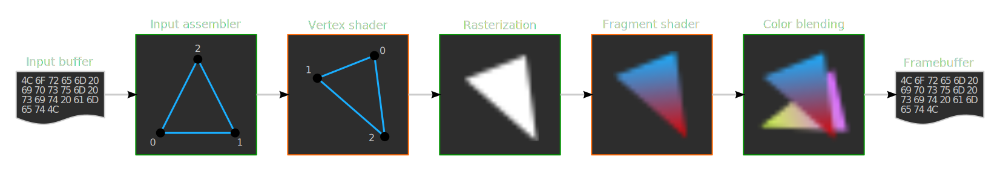
<!-- .element class="full-width" -->

Notes:
- Simplified view, modern pipelines are more complex.
- Sequence of operations, transform inputs (vertices, textures) to  the pixels.
- Input assembler extracts raw vertex data from buffers.
- Vertex shader runs for every vertex (usually applies transforms).
- Rasterization brakes primitive into fragments.
- Fragment shader runs for every fragment (usually determines its color).
- Color blending mixes fragments for one pixel.  

--v--

## Graphics pipeline (actual)


--v--

## High level components

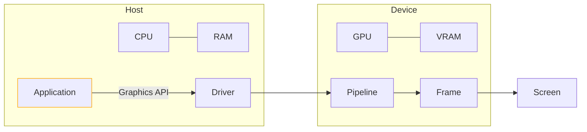
<!-- .element class="full-width" -->

Notes:
- Async architecture similar to *client-server*
- Host: computer itself with OS and application
- Device: dedicated board or logical component (e.g. integrated GPU in laptop)

--v--

## Graphics APIs


Notes:
- Started in 1990s with proprietary device specific APIs.
- OpenGL: cross-language, cross-platform API for graphics.
- Vulkan: a ground-up redesign of API, not backwards compatible with OpenGL.
- DirectX: Microsoft's take on graphics API. 12th version offers low-level API.
- Metal: Apple's graphics API
- There are also APIs dedicated for compute.

--v--

## Working with API functions

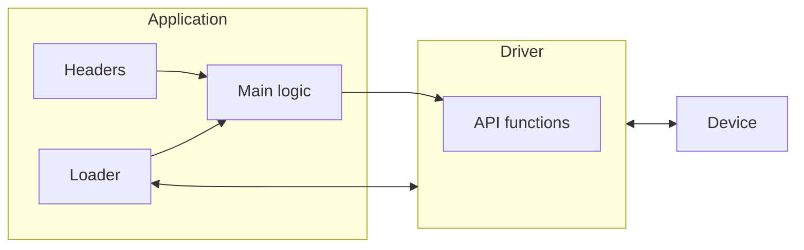

Notes:
- API is part of driver and is usually implemented in `C` (due to compatibility).
- Headers provide the signatures of the functions (names, parameters).
- Loader helps to find binary implementation of the functions.
- Application calls the API functions.
- We will use `C++` for our project. There is bindings layer in case of other languages.

--s-- 

## Project tools

> "Coding is basically just ifs and for loops" - John Carmack
<!-- .element class="full-width" -->

- C++23
  - only ifs and loops, nothing fancy
- decent C++ compiler
  - Clang, MSVC, GCC
- CMake for build management
- decent IDE for syntax and autocomplete
  - VS Code, neovim, VS, CLion, ...

--v--

## Project structure

```
git clone https://github.com/Vitaljok/cg-demo.git
git checkout 01-window
```

```cmake
cg-demo/ 
+-- CMakeLists.txt        # root CMake script
+-- assets/               # textures, models, shaders, etc
+-- cmake/                # useful CMake scripts
+-- shared/               # useful utility functions
+-- ext/                  # external libraries
    +-- CMakeLists.txt    
    +-- glad/             
+-- opengl-demo/          # current demo project
    +-- CMakeLists.txt    
    +-- main.cpp          
+-- vulkan-demo/          # maybe some day :)
```

--v--

## CMake


<!-- .element class="r-stretch" -->

Notes:
- A tool to manage building of source code.
- Generates modern build systems as well as project files for IDEs.

--v--

## Root CMake script

```cmake
# ./CMakeLists.txt
cmake_minimum_required(VERSION 3.23)

project("CG Demo" LANGUAGES CXX C)
set(CMAKE_CXX_STANDARD 23)

if (MSVC)
  add_compile_options(/W4 /WX)
else()
  add_compile_options(-Wall -Wextra -Wpedantic)
endif()

add_subdirectory(ext)
add_subdirectory(opengl-demo)
```

--v--

## External libraries: GLFW

Simple multi-platform API for creating windows

```cmake
# ./ext/CMakeLists.txt
Include(FetchContent)

# GLFW
FetchContent_Declare(
  glfw
  GIT_REPOSITORY https://github.com/glfw/glfw.git
  GIT_TAG 3.4
  GIT_SHALLOW TRUE
)
FetchContent_MakeAvailable(glfw)

add_library(glfw::glfw ALIAS glfw)

```
Notes:
- There are many ways to add external libraries to the project, such as system-wide installation, binary distributions, git submodules, copy of source code, etc.
- FetchContent automatically downloads and builds source code of the library.

--v--

## External libraries: GLAD

Multi-Language OpenGL loader-generator ( https://gen.glad.sh/ )

```cmake
# ./ext/CMakeLists.txt

# GLAD (downloaded from https://gen.glad.sh/)
add_library(glad 
    STATIC
    glad/src/gl.c
)
target_include_directories(glad
    PUBLIC
    glad/include
)
add_library(glad::glad ALIAS glad)

```

Note:
- Source code is included as a part of project.

--v--

## `glad/gl.h`

```c++
#define GL_CLEAR 0x1500
#define GL_CLEAR_BUFFER 0x82B4
#define GL_CLEAR_TEXTURE 0x9365

...

typedef void (GLAD_API_PTR *PFNGLCLEARPROC)(GLbitfield mask);
GLAD_API_CALL PFNGLCLEARPROC glad_glClear;
#define glClear glad_glClear
```
## `src/gl.c`

```c++
glad_glClear = (PFNGLCLEARPROC) load(userptr, "glClear");
glad_glClearColor = (PFNGLCLEARCOLORPROC) load(userptr, "glClearColor");
glad_glClearDepth = (PFNGLCLEARDEPTHPROC) load(userptr, "glClearDepth");

```
Note:
- Function pointers and their lookup in driver.

--v--

## OpenGL project

```cmake
# ./opengl-demo/CMakeLists.txt
add_executable(opengl-demo
    main.cpp
)

target_link_libraries(opengl-demo
    PRIVATE
    glad::glad
    glfw::glfw
)
```

--v--

## Handling errors


--cols--

```c++
int main() {
  ...
  auto success = glDoSomething();
  if (!success) {
    std::println("Something went wrong.");
    return -1;
  }
  ...
}
```
<!-- .element class="full-width" -->

--c--

```c++
void someDeepInternalFunction() {
  ...
  auto success = glDoSomething();
  if (!success) {
    std::println("Something went wrong.");
    return; // <--- ???
  }
  ...
}
```
<!-- .element class="full-width" -->
--cols--

Notes:
- Repeating `println`.
- Chain returns over call stack.

--v--
## Handling errors

--cols--

```c++
int main() {
  try {
    runOpenGLDemo();
  } catch (std::exception &ex) {
    std::println("EXCEPTION: {}", ex.what());
    return EXIT_FAILURE;
  }
  return EXIT_SUCCESS;
}
```
<!-- .element class="full-width" -->
--c--

```c++
void someDeepInternalFunction() {
  ...
  auto success = glDoSomething();
  if (!success) {
    throw std::runtime_error(
      "Something went wrong.");
  }
  ...
}
```
<!-- .element class="full-width" -->
--cols--

--s--

## 01 - Empty window

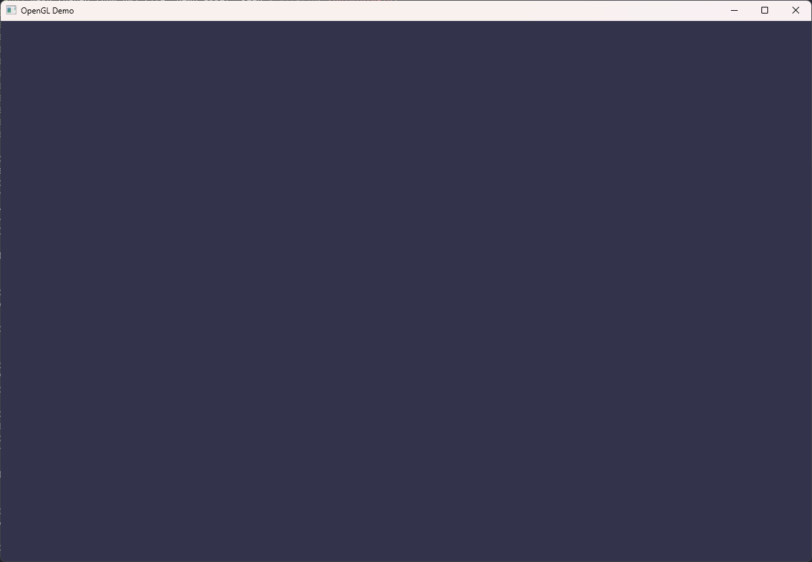
<!-- .element class="r-stretch" -->

--v--

## Creating GLFW window

```c++
// Important: include GLAD before GLFW
#include <glad/gl.h>

#include <GLFW/glfw3.h>
```

```c++
glfwInit();
glfwWindowHint(GLFW_CONTEXT_VERSION_MAJOR, 4);
glfwWindowHint(GLFW_CONTEXT_VERSION_MINOR, 6);
glfwWindowHint(GLFW_OPENGL_PROFILE, GLFW_OPENGL_CORE_PROFILE);

GLFWwindow *window = 
      glfwCreateWindow(1200, 800, "OpenGL Demo", nullptr, nullptr);
glfwMakeContextCurrent(window);

...

glfwDestroyWindow(window);
glfwTerminate();

```

Notes:
- Include GLAD first, otherwise GLFW will load its own basic OpenGL header.
- `glfwWindowHint` - we want OpenGL 4.6 Core profile.
- `glfwMakeContextCurrent` - subsequent OpenGL calls will go to window context.

--v--

## OpenGL setup and drawing
```c++
gladLoadGL(glfwGetProcAddress);
// setup
glViewport(0, 0, 1200, 800);

while (!glfwWindowShouldClose(window)) {  
  // draw
  glClearColor(0.2f, 0.2f, 0.3f, 1.0f);
  glClear(GL_COLOR_BUFFER_BIT);
  
  // present
  glfwSwapBuffers(window);
  glfwPollEvents();
}
```

Notes:
- `gladLoadGL` loads OpenGL functions.
- "infinite" loop with drawing commands.
- `glClear` fills framebuffer with color.
- `glfwSwapBuffers` swaps back buffer.

--v--

## Handle window resize
```c++
void windowResizeCb(GLFWwindow *window, int width, int height) {
  glViewport(0, 0, width, height);
}

glfwSetFramebufferSizeCallback(window, windowResizeCb);
```

## Read inputs
```c++
if (glfwGetKey(window, GLFW_KEY_ESCAPE)) {
  glfwSetWindowShouldClose(window, true);
}
```

--s--

## 02 - Hello triangle

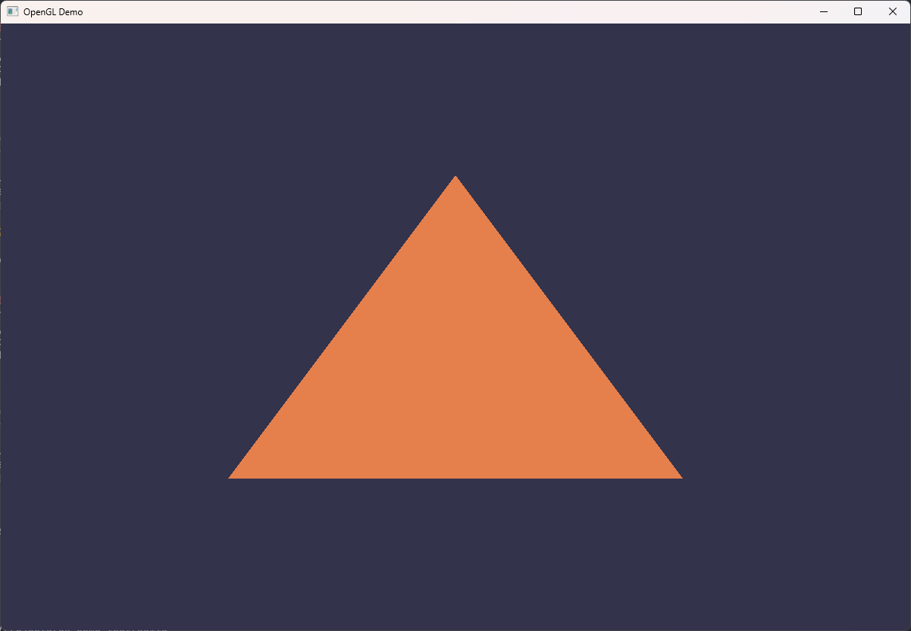
<!-- .element class="r-stretch" -->

--v--

## OpenGL State Machine


<!-- .element class="r-stretch" -->

--v--

## OpenGL State Machine (example)

```c++
glViewport(0, 0, 1200, 800);          // state
glClearColor(0.2f, 0.2f, 0.3f, 1.0f); // state
glClear(GL_COLOR_BUFFER_BIT);         // action

glEnable(GL_DEPTH_TEST);              // state
glDrawBuffer(...);                    // action

glBindTexture(GL_TEXTURE_2D, 42);     // state
glDrawBuffer(...);                    // action

```

Notes:
- Similar to mixing console with a lot of knobs and switches.
- Depending on internal state, the same input can produce different outputs.
- Default values can vary between vendors.
- "Draw" calls use whole state, not only recent changes.


--s--

## Input assembler


- Provide vertex coordinates (bytes) as input
- Build primitives from the coordinates (triangle)

--v--

## Normalized Device Coordinates

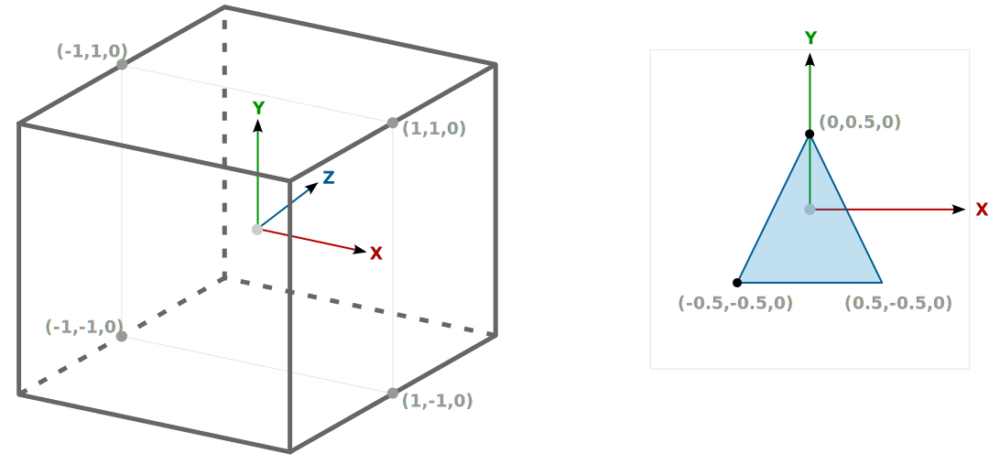

--v--

## Input buffer

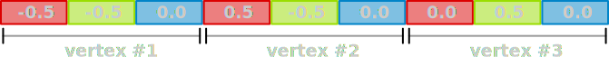


```c++
// raw array
const float vertices[] = {-0.5, -0.5, 0.0, 0.5, -0.5, 0.0, 0.0, 0.5, 0.0};

// collection of GLM structs
const std::vector<glm::vec3> vertices = {
    {-0.5, -0.5, 0.0},
    { 0.5, -0.5, 0.0},
    { 0.0,  0.5, 0.0},
};
```

Notes:
- input buffer will grow on later stages
- structs are easier to work with
- memory layout is the same

--v--

## Vertex Array Object (VAO)

- Where to read input from? - memory buffers
- How to interpret input? - vertex attribute description


```c++
// variable for VAO identifier
GLuint vertexArray;
// create the VAO
glGenVertexArrays(1, &vertexArray);
// activate the VAO
glBindVertexArray(vertexArray);
```

--v--

## Vertex Buffer Object (VBO)

- Memory buffer in device VRAM for vertex data

```c++
// variable for buffer ID
GLuint vertexBuf;
// create memory buffer in device VRAM
glGenBuffers(1, &vertexBuf);
// activate buffer
glBindBuffer(GL_ARRAY_BUFFER, vertexBuf);
// upload bytes to the buffer
// 3(vtx) x 3(attr) x 4(float) = 36 bytes
glBufferData(GL_ARRAY_BUFFER, sizeof(vertices[0]) * vertices.size(),
              vertices.data(), GL_STATIC_DRAW);
```

Note:
- the buffer will belong to previously activated VAO object

--v--

## Vertex attribute description

```c++
// enable attribute #0
glEnableVertexAttribArray(0);

// describe attribute #0
// number of components: 3 (X, Y, Z)
// data type for each component: GL_FLOAT
// normalized: GL_FALSE - interpret directly as floats
// byte offset between attributes: 3 * 4 = 12 bytes
// offset of the first component of the first attribute: 0
glVertexAttribPointer(0, 3, GL_FLOAT, GL_FALSE, sizeof(glm::vec3), (void *)0);
```

--v--

## Vertex Array Object (all together)

```c++
// VAO - Vertex Array Object
GLuint vertexArray;
glGenVertexArrays(1, &vertexArray);
glBindVertexArray(vertexArray);

// VBO - Vertex Buffer Object
GLuint vertexBuf;
glGenBuffers(1, &vertexBuf);
glBindBuffer(GL_ARRAY_BUFFER, vertexBuf);
glBufferData(GL_ARRAY_BUFFER, sizeof(vertices[0]) * vertices.size(),
              vertices.data(), GL_STATIC_DRAW);

glEnableVertexAttribArray(0);
glVertexAttribPointer(0, 3, GL_FLOAT, GL_FALSE, sizeof(glm::vec3), (void *)0);
```

--s--

## Shaders


- Run some logic *for each* vertex / fragment
- Produce inputs for the next stages
- GLSL (OpenGL Shading Language)

--v--

## Vertex shader

```glsl
#version 450 core

// input #0 in VAO attributes
layout(location = 0) in vec3 aPos;

void main() {
  // very complex transformation of coordinates
  gl_Position = vec4(aPos.xyz, 1.0);
}
```

Note:
- Output `gl_Position` as (x,y,z,w) vector
- `w` is perspective division

--v--

## Fragment shader

```glsl
#version 450 core

// by default output #0 is shown on the framebuffer
layout(location = 0) out vec4 fragColor;

void main() {
  // very complex color (RGBA) calculations 
  fragColor = vec4(0.9, 0.5, 0.3, 1.0);
}
```
--v--

## Shader compilation

```c++
GLuint vertexShader = glCreateShader(GL_VERTEX_SHADER);

const char *src = "...source of the shader...";
glShaderSource(vertexShader, 1, &src, NULL);
glCompileShader(vertexShader);

GLint success;
glGetShaderiv(vertexShader, GL_COMPILE_STATUS, &success);
if (!success) {
  std::string info(512, 0);
  glGetShaderInfoLog(vertexShader, 512, NULL, info.data());
  throw std::runtime_error(
      std::format("Vertex shader compilation failed\n{}", info));
}
```
Note:
- compilation happens at runtime

--v--

## Shader linking

```c++
GLuint shaderProgram = glCreateProgram();

glAttachShader(shaderProgram, vertexShader);
glAttachShader(shaderProgram, fragmentShader);
glLinkProgram(shaderProgram);

GLint success;
glGetProgramiv(shaderProgram, GL_LINK_STATUS, &success);
if (!success) {
  std::string info(512, 0);
  glGetProgramInfoLog(shaderProgram, 512, NULL, info.data());
  throw std::runtime_error(
      std::format("Shader program linking failed\n{}", info));
}
```

--v--

## Shader source

```c++
// awkward
const char *src = "...source of the shader...";

// read text file to string
std::string source = readTextFile("assets/shaders/opengl-demo/demo.vert");
// get raw pointer to C-string when needed
const char *src = source.c_str();
```

--v--

## File utilities

```cmake
# ./shared/CMakeLists.txt

add_library(demo_shared 
    STATIC
    demo/utils.cpp
)
target_link_libraries(demo_shared)
target_include_directories(demo_shared PUBLIC . )
add_library(demo::shared ALIAS demo_shared)
```

```c++
std::vector<uint8_t> readFile(const std::string &fileName);

std::string readTextFile(const std::string &fileName);
```

--v--

## Shader organization

- Shaders are heavily dependant on C++ source
  - input buffers
  - attribute descriptions
- Shaders are accessed at runtime 
  - executable path
- Shaders *can be* provided in binary format
  - compiled offline into intermediate representation
  - SPIR-V for Vulkan

Note:
- It is bad idea to mix sources and build artifacts.

--v--

## Shader organization

--cols--

```cmake
# ./opengl-demo/CMakeLists.txt
include(cmake/ShaderUtils.cmake)

add_executable(opengl-demo
    main.cpp
)

add_shaders(opengl-demo
    demo.frag
    demo.vert
)
```
<!-- .element class="full-width" -->

--c--

```cmake
cg-demo/ 
+-- assets/
    +-- shaders/
        +-- opengl-demo
            +-- demo.frag  # asset files 
            +-- demo.vert  # text or binary
+-- opengl-demo/
    +-- CMakeLists.txt 
    +-- demo.frag          # original
    +-- demo.vert          # sources
    +-- main.cpp
``` 
<!-- .element class="full-width" -->

--cols--

Notes:
- Asset files are produced by build system.
- Shaders can be compiled into SPIR-V

--s--

## Running pipeline


--v--

## Running pipeline

```c++
// setup VAO, shaders, etc.
...

while (!glfwWindowShouldClose(window)) {
  ...
  // activate program
  glUseProgram(shaderProgram);
  // activate VAO
  glBindVertexArray(vertexArray);
  // draw 3 vertices
  glDrawArrays(GL_TRIANGLES, 0, 3);
  ...
}
```

--v--

## Hello, triangle! :wave:


<!-- .element class="r-stretch" -->

--v--

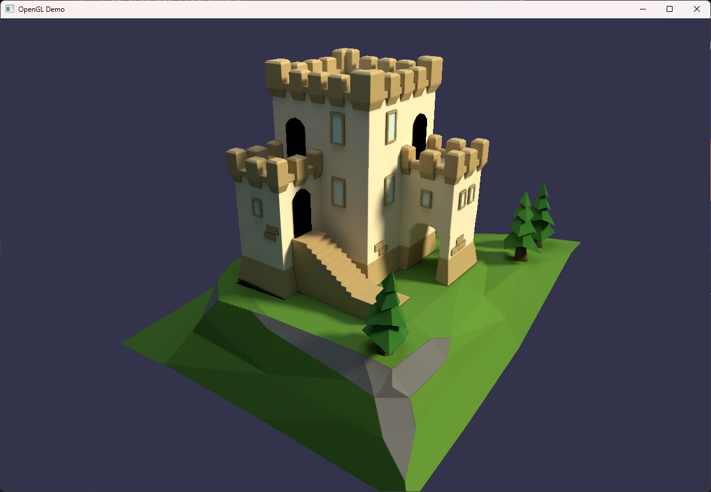
<!-- .element class="r-stretch" -->