# 3D Graphics Programming

## From hello triangle to textured mesh

Vitalijs Komasilovs

--s--

## Drawing "complex" objects

--cols--

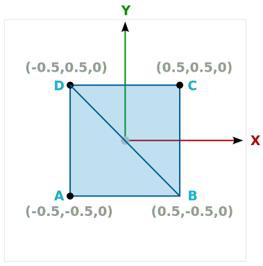

--c--

<br>

```c++
const std::vector<glm::vec3> vertices = {
    // 1st triangle
    {-0.5, -0.5, 0.0}, // A
    { 0.5, -0.5, 0.0}, // B
    {-0.5,  0.5, 0.0}, // D
    // 2nd triangle
    { 0.5, -0.5, 0.0}, // B <-- !!!
    { 0.5,  0.5, 0.0}, // C 
    {-0.5,  0.5, 0.0}, // D <-- !!!
};
```

--cols--

--v--

## Vertices and indices

--cols--


--c--

<br>

```c++
const std::vector<glm::vec3> vertices = {
    {-0.5, -0.5, 0.0}, // A
    { 0.5, -0.5, 0.0}, // B
    { 0.5,  0.5, 0.0}, // C
    {-0.5,  0.5, 0.0}, // D
};

const std::vector<uint32_t> indices = {
    0, 1, 3, 1, 2, 3
};
```

--cols--

--v--

## Data structures

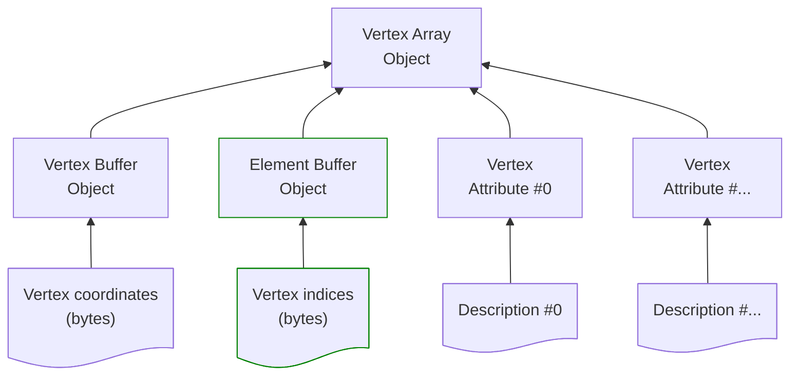

--v-- 

## Element Buffer Object (EBO)

```c++
// VAO
...

// VBO
...

// EBO
GLuint indexBuf;
glGenBuffers(1, &indexBuf);
glBindBuffer(GL_ELEMENT_ARRAY_BUFFER, indexBuf);
glBufferData(GL_ELEMENT_ARRAY_BUFFER, sizeof(indices[0]) * indices.size(),
            indices.data(), GL_STATIC_DRAW);
```

--v--

## Indexed drawing

```diff
  glUseProgram(shaderProgram);
  glBindVertexArray(vertexArray);
- glDrawArrays(GL_TRIANGLES, 0, vertices.size());
+ glDrawElements(GL_TRIANGLES, indices.size(), GL_UNSIGNED_INT, (void *)0);

```

--v--

## Hello rectangle

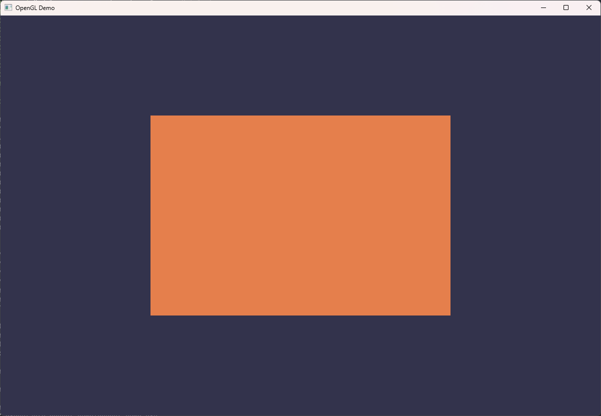
<!-- .element class="r-stretch" -->

--s--

## Vertex attributes


```c++
const std::vector<glm::vec3> vertices = {
    {-0.5, -0.5, 0.0},
    { 0.5, -0.5, 0.0},
    { 0.5,  0.5, 0.0},
    {-0.5,  0.5, 0.0},
};
```

--v--

## More vertex attributes

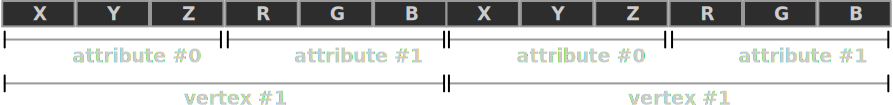

```c++
struct VertexData {
  glm::vec3 pos;
  glm::vec3 color;
};

const std::vector<VertexData> vertices = {
    { {-0.5, -0.5, 0.0}, {1.0, 1.0, 1.0} },
    { { 0.5, -0.5, 0.0}, {1.0, 0.0, 0.0} },
    { { 0.5,  0.5, 0.0}, {0.0, 1.0, 0.0} },
    { {-0.5,  0.5, 0.0}, {0.0, 0.0, 1.0} },
};

```

--v--

## Vertex attribute descriptions

```c++
glEnableVertexAttribArray(0);
glVertexAttribPointer(
    0, 3, GL_FLOAT, GL_FALSE, 
    sizeof(VertexData),
    (void *)offsetof(VertexData, pos)
);

glEnableVertexAttribArray(1);
glVertexAttribPointer(
    1, 3, GL_FLOAT, GL_FALSE, 
    sizeof(VertexData),
    (void *)offsetof(VertexData, color)
);

```

--v--

## Vertex shader

```glsl
#version 450 core

layout(location = 0) in vec3 aPos;
layout(location = 1) in vec3 aColor;

layout(location = 0) out vec3 vertexColor;

void main() {
  // very complex transformation of coordinates
  gl_Position = vec4(aPos.xyz, 1.0);
  // very complex color manipulation
  vertexColor = aColor;
}
```

--v--

## Fragment shader

```glsl
#version 450 core

layout(location = 0) in vec3 vertexColor;

layout(location = 0) out vec4 fragColor;

void main() {
  // very complex pixel color (RGBA) calculations
  fragColor = vec4(vertexColor, 1.0);
}
```
--v--

## Colored rectangle

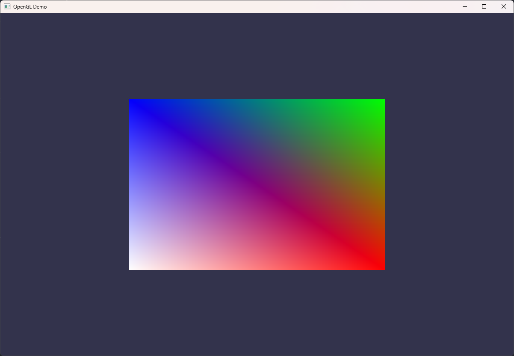
<!-- .element class="r-stretch" -->


--v--

## Attribute interpolation


Rasterization stage interpolates attributes<br>
(position, color, or any other value).

--s--

## Uniforms

- Attributes are specified *per element*
    - vertex, e.g. from input buffers
    - fragment, e.g. interpolated
    
- Uniforms are specified *per shader program*
    - global, available in all stages

--v--

## Updating uniforms

```c++
...

glUseProgram(shaderProgram);

// calculate value dynamically, i.e. animate
float ts = glfwGetTime();
float value = sin(ts) / 2.0f + 0.5f;
// set uniform value
glUniform1f(0, value);

...
```

--v--

## Fragment shader

```glsl
#version 450 core

layout(location = 0) in vec3 vertexColor;
layout(location = 0) uniform float value;

layout(location = 0) out vec4 fragColor;

void main() {
  // very complex pixel color (RGBA) calculations
  fragColor = vec4(vertexColor * value, 1.0);
}
```
--v--

## Animated colored rectangle

<div class="r-stack r-stretch">
    
    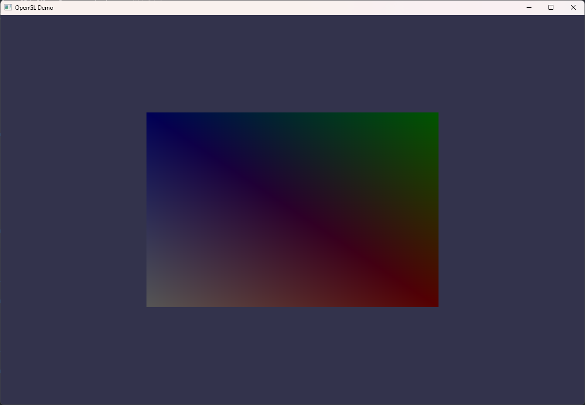
</div>

--s--

## Problem adding details

How to add more details to the objects (e.g. colors)?
- add more vertices with color attributes;
- triangles on screen become smaller;
- coloring few pixels &rArr; naive algorithm;
- naive algorithm &rArr; slow rendering.

--v--

## Textures

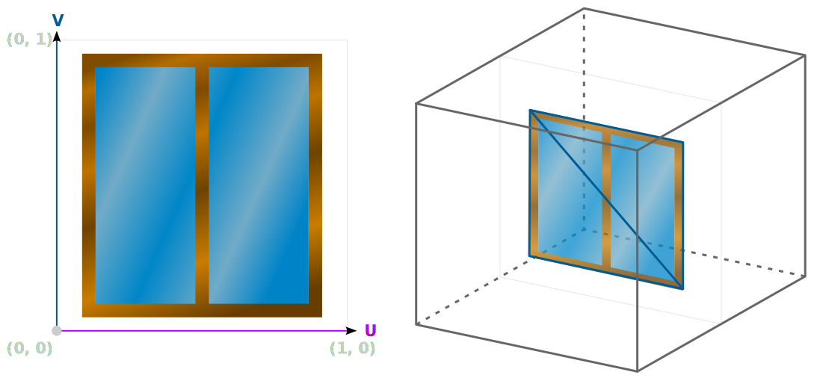

--v--

## Texture coordinates 

```c++
struct VertexData {
    glm::vec3 pos;
    glm::vec3 color;
    glm::vec2 uv;
};

const std::vector<VertexData> vertices = {
    {{-0.5, -0.5, 0}, {1.0, 1.0, 1.0}, {0.0, 0.0}},
    {{ 0.5, -0.5, 0}, {1.0, 0.0, 0.0}, {1.0, 0.0}},
    {{ 0.5,  0.5, 0}, {0.0, 1.0, 0.0}, {1.0, 1.0}},
    {{-0.5,  0.5, 0}, {0.0, 0.0, 1.0}, {0.0, 1.0}},
};
```

--v--

## UV attribute description

```c++
// Attributes #0 and #1
...

glEnableVertexAttribArray(2);
glVertexAttribPointer(
    2, 2, GL_FLOAT, GL_FALSE,
    sizeof(VertexData),
    (void *)offsetof(VertexData, uv)
);
```

--v--

## Vertex shader

```glsl
#version 450 core

layout(location = 0) in vec3 aPos;
layout(location = 1) in vec3 aColor;
layout(location = 2) in vec2 aUV;

layout(location = 0) out vec3 vertexColor;
layout(location = 1) out vec2 uv; 

void main() {
  gl_Position = vec4(aPos.xyz, 1.0);
  vertexColor = aColor;
  uv = aUV;
}
```

--v--

## Reading image files

Single-file library https://github.com/nothings/stb

```c++
#define STB_IMAGE_IMPLEMENTATION
#include "stb_image.h"
```

```c++
int width, height, nChannels;
uint8_t *pixels = stbi_load("assets/textures/old_wood.jpg",
                            &width, &height, &nChannels, 0);
if (!pixels) {
    throw std::runtime_error("Failed to load texture image");
}

...

stbi_image_free(pixels);
```

--v--

## Creating and uploading texture

```c++
GLuint woodTexture;
glGenTextures(1, &woodTexture);
glBindTexture(GL_TEXTURE_2D, woodTexture);

glTexParameteri(GL_TEXTURE_2D, GL_TEXTURE_WRAP_S, GL_REPEAT);
glTexParameteri(GL_TEXTURE_2D, GL_TEXTURE_WRAP_T, GL_REPEAT);
glTexParameteri(GL_TEXTURE_2D, GL_TEXTURE_MIN_FILTER, GL_LINEAR_MIPMAP_LINEAR);
glTexParameteri(GL_TEXTURE_2D, GL_TEXTURE_MAG_FILTER, GL_LINEAR);

glTexImage2D(GL_TEXTURE_2D, 0, GL_RGB, width, height, 0, GL_RGB,
             GL_UNSIGNED_BYTE, pixels);
glGenerateMipmap(GL_TEXTURE_2D);
```

--v--

## Drawing with textures

```c++
...
   
glUniform1i(1, 0); // location=1, unit=GL_TEXTURE0
glActiveTexture(GL_TEXTURE0);
glBindTexture(GL_TEXTURE_2D, woodTexture);

glUniform1i(2, 1); // location=2, unit=GL_TEXTURE1
glActiveTexture(GL_TEXTURE1);
glBindTexture(GL_TEXTURE_2D, smileTexture);

...

glBindVertexArray(vertexArray);
glDrawElements(GL_TRIANGLES, indices.size(), GL_UNSIGNED_INT, (void *)0);
```

--v--

## Fragment shader

```glsl
layout(location = 0) in vec3 vertexColor;
layout(location = 1) in vec2 uv;

layout(location = 0) uniform float value;
layout(location = 1) uniform sampler2D tex1;
layout(location = 2) uniform sampler2D tex2;

layout(location = 0) out vec4 fragColor;

void main() {
  vec4 clrTex1 = texture(tex1, uv);
  vec4 clrTex2 = texture(tex2, uv);
  vec4 clrVtx = vec4(vertexColor, 1.0f);
  fragColor = mix(clrTex1 * clrVtx, clrTex2, value);
}
```

--v--

## Textured rectangle

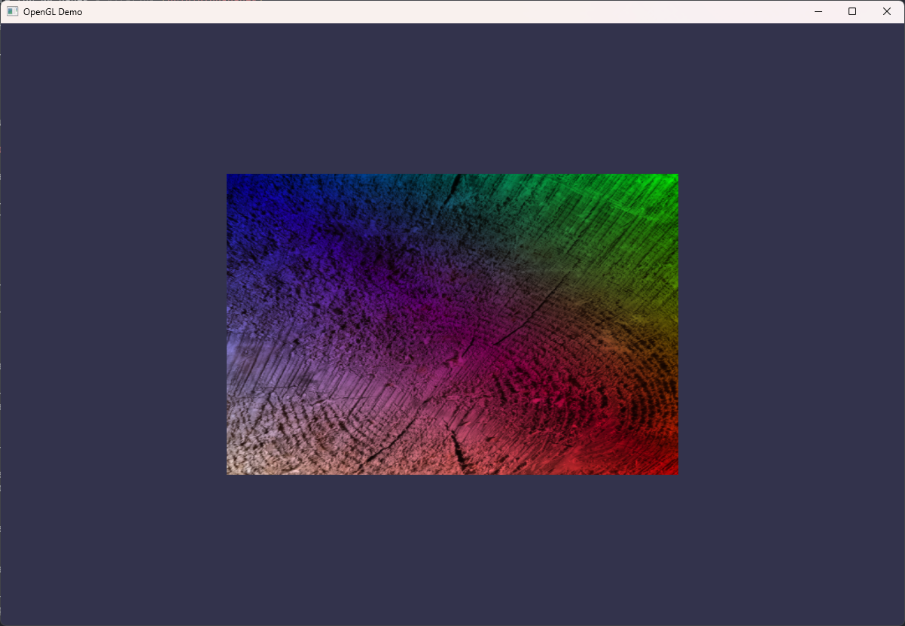
<!-- .element class="r-stretch" -->

--s--

## Transformations

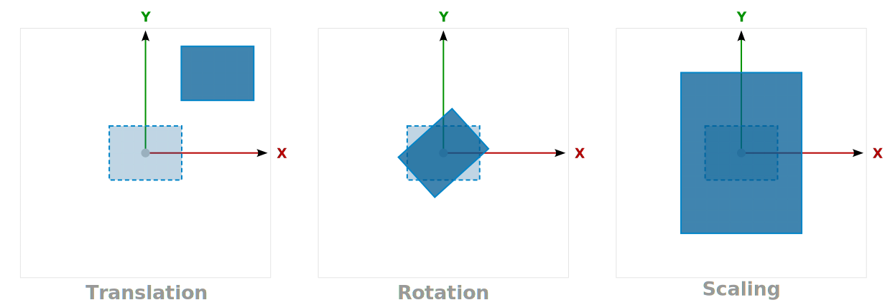

--v--

## Transformation order matters

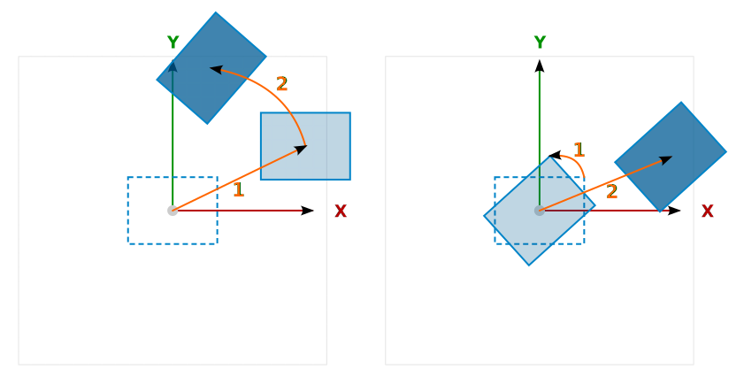

--v--

## Math tricks

$
T = \text{\\{rotation, translation, scale, ...\\}}
$

$
T \cdot\left(x, y, z\right)
\Rightarrow
\left(x', y', z'\right)
$

--v--

## Matrix and vector multiplication

$
\begin{bmatrix}
? & ? & ? & ?
\\\\
? & ? & ? & ? 
\\\\
? & ? & ? & ?
\\\\
0 & 0 & 0 & 1
\end{bmatrix}
\cdot
\begin{pmatrix}
x \\\\ y \\\\ z \\\\ 1 
\end{pmatrix}=
\begin{pmatrix}
x' \\\\ y' \\\\ z' \\\\ 1
\end{pmatrix}
$


```glsl
gl_Position = vec4(x, y, z, 1.0);
```
--v--

## Transformation matrix uniform

```c++
#include <glm/gtc/matrix_transform.hpp>
#include <glm/gtc/type_ptr.hpp>

// fill transformation matrix
glm::mat4 trans = glm::mat4(1.0f);
trans = glm::translate(trans, {0.75f, 0.25f, 0.0f});
trans = glm::scale(trans, {0.25f, 0.75f, 0.0f});
trans = glm::rotate(trans, 0.75f, {0.0f, 0.0f, 1.0f});

// upload to GPU, location=3
glUniformMatrix4fv(3, 1, GL_FALSE, glm::value_ptr(trans));
```

--v--

## Vertex shader
```glsl
...
layout(location = 3) uniform mat4 transform;

void main() {
  gl_Position = transform * vec4(aPos.xyz, 1.0);
  ...
}

```
--v--
## Transformed rectangle

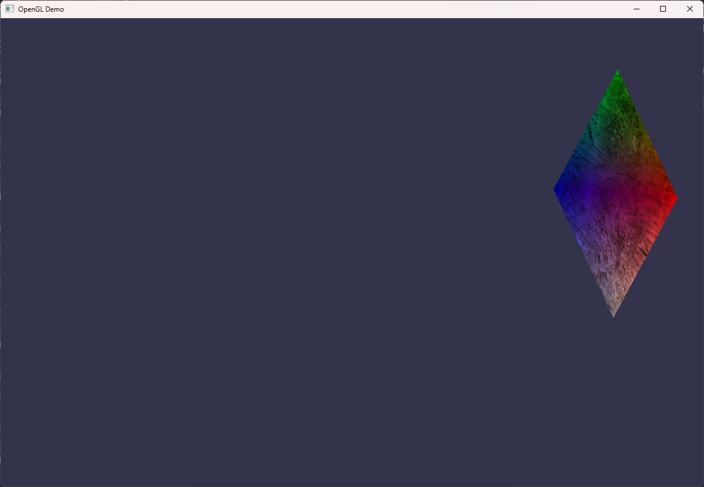
<!-- .element class="r-stretch" -->

--s--

## Coordinate systems
--cols--
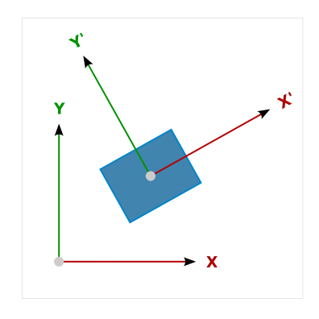

--c--
<br>

- Define reference points
- Easier operations / calculations
- Applied in step-by-step manner
- Goal: get Normalized Device Coordinates

--cols--

Notes:
Define vertices in one coordinate system, and later transform to another.

--v--

## Model (world) space

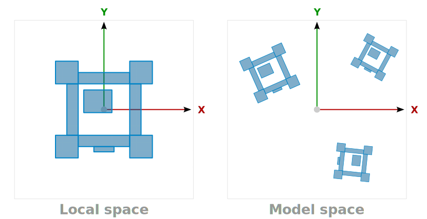


--v--

## View (camera) space

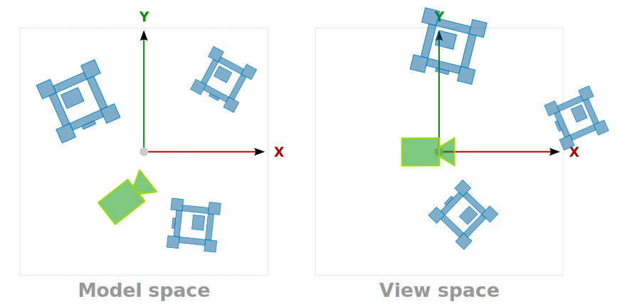

--v--

## Projection (clip) space

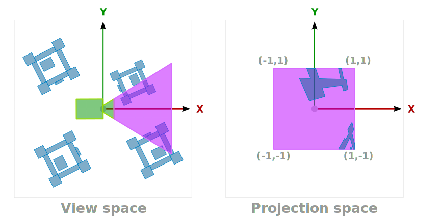

--v--

## Transformation matrices

```c++
glm::mat4 model = glm::mat4(1.0f);
model = glm::rotate(model, glm::radians(-75.0f), glm::vec3(1.0f, 0.0f, 0.0f));

glm::mat4 view = glm::mat4(1.0f);
view = glm::translate(view, glm::vec3(0.0f, -0.5f, -3.0f));

glm::mat4 projection = glm::perspective(
    glm::radians(45.0f), (float)1200 / (float)800, 0.1f, 100.0f);

glUniformMatrix4fv(3, 1, GL_FALSE, glm::value_ptr(model));
glUniformMatrix4fv(4, 1, GL_FALSE, glm::value_ptr(view));
glUniformMatrix4fv(5, 1, GL_FALSE, glm::value_ptr(projection));
```

--v--

## Vertex shader

```glsl
...
layout(location = 3) uniform mat4 model;
layout(location = 4) uniform mat4 view;
layout(location = 5) uniform mat4 projection;

void main() {
  gl_Position = projection * view * model * vec4(aPos.xyz, 1.0);
  ...
}
```

--v--

## Rotated rectangle in perspective

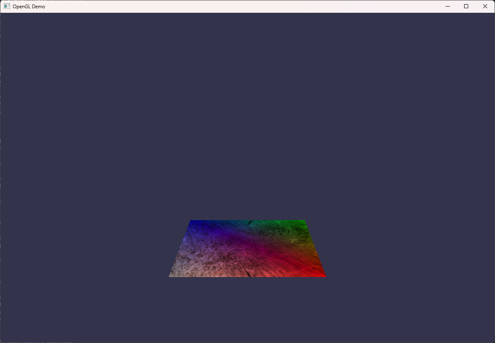
<!-- .element class="r-stretch" -->

--s-- 

## Drawing multiple objects

```c++
std::array positions = {glm::vec3(-2.0f, 2.0f, -5.0f), ...};

...
glm::mat4 view = ...
glm::mat4 projection = ...
...

glBindVertexArray(vertexArray);

for (size_t i = 0; i < positions.size(); i++) {
    glm::mat4 model = glm::mat4(1.0f);
    model = glm::translate(model, positions[i]);
    glUniformMatrix4fv(Uniforms::model, 1, GL_FALSE, glm::value_ptr(model));
    
    glDrawElements(GL_TRIANGLES, indices.size(), GL_UNSIGNED_INT, (void *)0);
}

```

--v--

## Multiple rectangles in perspective

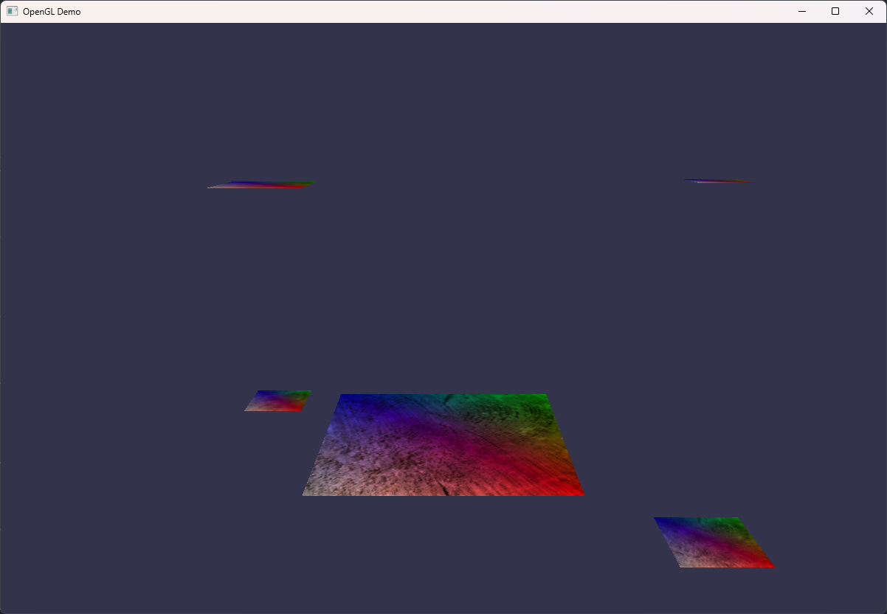
<!-- .element class="r-stretch" -->


--s--

## Exporting models from DCCs

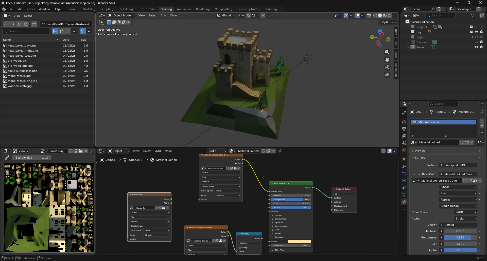
<!-- .element class="r-stretch" -->

--v--

## OBJ file format

--cols--
```
# Blender 5.0.1
# www.blender.org
o Keep
v -3.250000 5.000000 3.250000
v -3.250000 5.000000 -3.250000
v 3.250000 5.000000 -3.250000
...
vt 0.606747 0.881346
vt 0.608294 0.199824
vt 0.533257 0.199893
...
f 12/1/1 11/2/1 5/3/1
f 17/5/2 16/6/2 32/7/2
f 43/9/3 34/10/3 4/11/3
```
--c--
<br>

- Easy to parse (text format)
- Widely supported
- Vertex coordinates
- Colors (normals)
- UV coordinates
- ...

--cols--

--v--


## The Open Asset Import Library (ASSIMP)

```cmake
# ./ext/CMakeLists.txt

FetchContent_Declare(
  assimp
  GIT_REPOSITORY https://github.com/assimp/assimp.git
  GIT_TAG        v6.0.2
  GIT_SHALLOW    TRUE
)
set(ASSIMP_BUILD_ALL_IMPORTERS_BY_DEFAULT OFF)
set(ASSIMP_BUILD_ALL_EXPORTERS_BY_DEFAULT OFF)
set(ASSIMP_BUILD_OBJ_IMPORTER ON)
set(ASSIMP_BUILD_TESTS OFF)
FetchContent_MakeAvailable(assimp)
```

--v--

## Importing mesh

```c++
#include <assimp/Importer.hpp>
#include <assimp/postprocess.h>
#include <assimp/scene.h>

Assimp::Importer importer;
auto scene =
    importer.ReadFile("assets/meshes/keep.obj", aiProcess_Triangulate);

// for now assume single mesh model
auto mesh = scene->mMeshes[0]; 

// use imported data
... 

importer.FreeScene();
```

--v--

## Vertices

```c++
std::vector<VertexData> vertices;

for (size_t i = 0; i < mesh->mNumVertices; i++) {
    auto vtx = mesh->mVertices[i];
    auto uvs = mesh->mTextureCoords[0][i];

    VertexData data;
    data.pos = {vtx.x, vtx.y, vtx.z};
    data.uv = {uvs.x, uvs.y};
    vertices.push_back(data);
}
```
--v--

## Indices

```c++
std::vector<uint32_t> indices;

for (size_t i = 0; i < mesh->mNumFaces; i++) {
    auto face = mesh->mFaces[i];
    for (size_t j = 0; j < face.mNumIndices; j++) {
        indices.push_back(face.mIndices[j]);
    }
}
```

--v--

## Few tricks

```c++
Texture dayTexture("assets/textures/keep_baked_day.png");
Texture nightTexture("assets/textures/keep_baked_night.png");
```
```c++
float dayNight = sin(glfwGetTime() / 2.0f) * 5.0f + 0.5f;
glUniform1f(3, dayNight);
```
```c++
glm::mat4 view = glm::lookAt(...);
glUniformMatrix4fv(5, 1, GL_FALSE, glm::value_ptr(view));
```

```glsl
fragColor = mix(clrTex1, clrTex2, dayNight);
```

--v--

## Textured mesh with day-night cycle :sunglasses:

<div class="r-stack r-stretch">
    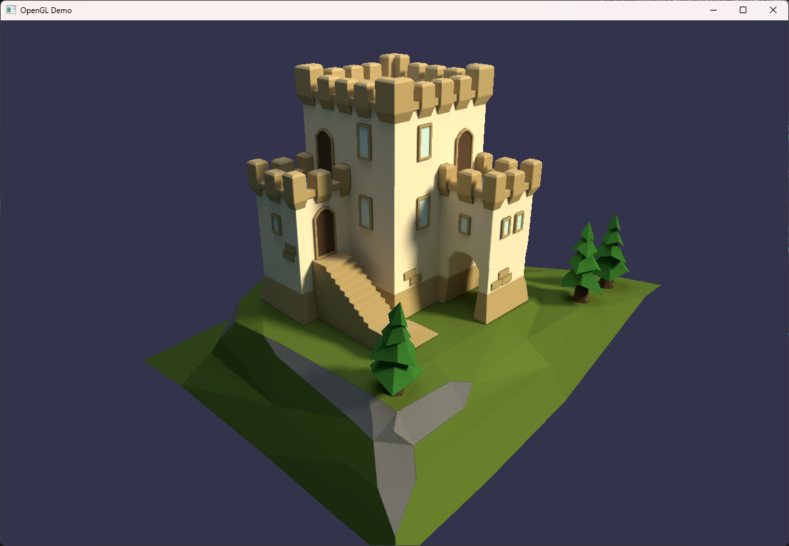
    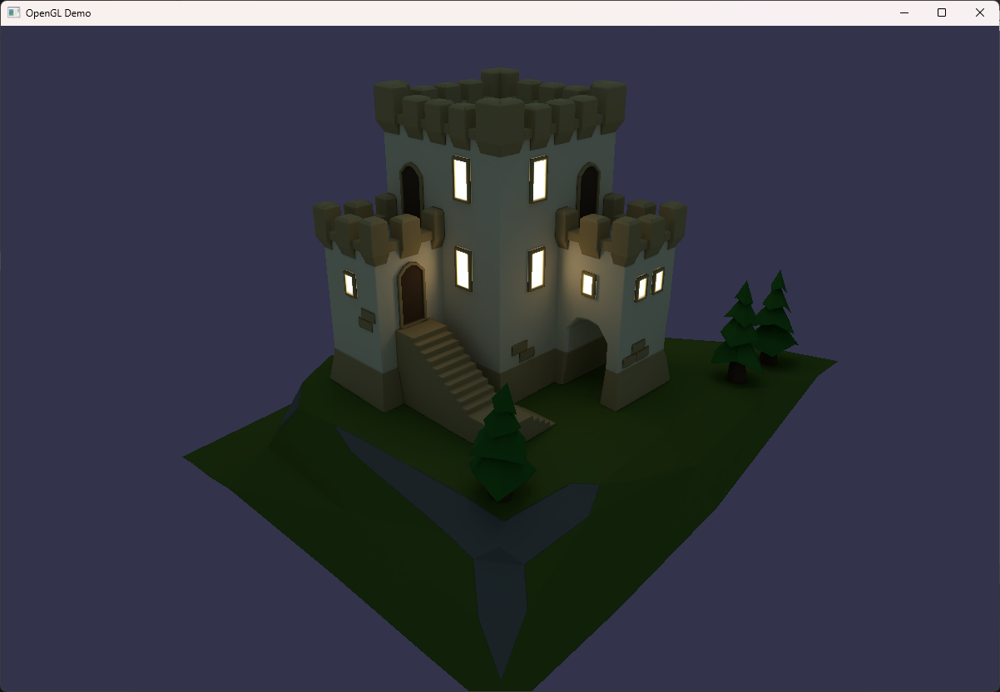
</div>

