# 3D Graphics Programming

## Shading

Vitalijs Komasilovs

--v--

## Refactoring

--cols--

```c++
void runOpenGLDemo() {
    GLFWwindow *window = ...;
    ...
    glGenVertexArrays(1, &vertexArray);
    ...
    while (!glfwWindowShouldClose(window)) {
        ...
        glDrawElements(...);
    }
    glfwDestroyWindow(window);
}

```
--c--

```c++
class OpenGLApp {
private:
    GLFWwindow *window;

public:
    void run() {
        init();
        mainLoop();
        cleanup();
  }
}
```
--cols--

--v--

## Mesh

```c++
class Mesh {
    std::vector<VertexData> vertices;
    std::vector<uint32_t> indices;
    Mesh(const char *fileName);

    GLuint vertexArray;
    GLuint vertexBuffer;
    GLuint indexBuffer;
    void upload();

    void draw();
};
```

--v--

## Shader program
```c++
class ShaderProgram {
    ShaderProgram(const char *vertexFileName, const char *fragmentFileName);

    GLint getLocation(const char *name);    
    void setFloat(const char *name, float value);
    void setMatrix(const char *name, const float *value);
    void setTexture(const char *name, int setId, GLuint value);
};
```

```c++
auto loc = glGetUniformLocation(shader, name);
glUniform1f(loc, value);
```

--s--

## Camera movement

--cols--


--c--

```c++
if (glfwGetKey(window, GLFW_KEY_W)) {
    position += speed * front;
}
if (glfwGetKey(window, GLFW_KEY_S)) {
    position -= speed * front;
}
if (glfwGetKey(window, GLFW_KEY_A)) {
    position -= speed * right;
}
if (glfwGetKey(window, GLFW_KEY_D)) {
    position += speed * right;
}
```

--cols--

--v--

## Camera rotation

--cols--

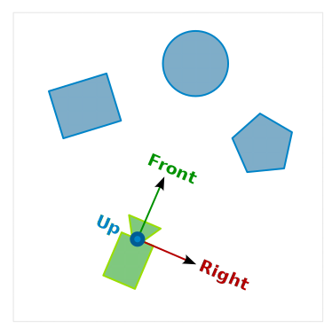

--c--

```c++
glfwGetCursorPos(window, &cursor.x, &cursor.y);
glm::dvec2 offset = cursor - lastCursor;

yaw += offset.x * sensitivity;
pitch += offset.y * sensitivity;

front = {cos(yaw) * cos(pitch),
         sin(pitch),
         sin(yaw) * cos(pitch)};

right = glm::cross(front, worldUp);
up = glm::cross(right, front);
```
--cols--

Notes:
- safety limits for pitch;
- vectors should be normalized.

--s--

## Dear ImGui library

> is a bloat-free graphical user interface library for C++

> outputs optimized vertex buffers to render in 3D-pipeline

> fast, portable, renderer agnostic, and self-contained

Notes:
- Every frame the GUI is rendered in forms of triangles. 
- So called immediate user interface.

--v--

## GUI example

```c++
ImGui::NewFrame();

ImGui::Begin("OpenGL Demo", nullptr, ImGuiWindowFlags_NoMove);

ImGui::Text("%.2f ms/frame", io.DeltaTime * 1000);
ImGui::Text("%d vertices", io.MetricsRenderVertices);

if (ImGui::CollapsingHeader("Camera")) {
    ImGui::Text("FOV: %.1f", fov);
    ImGui::Checkbox("Wireframe mode", wireframeMode);
}

ImGui::End();

ImGui::Render();
```
--s--

## Object colors


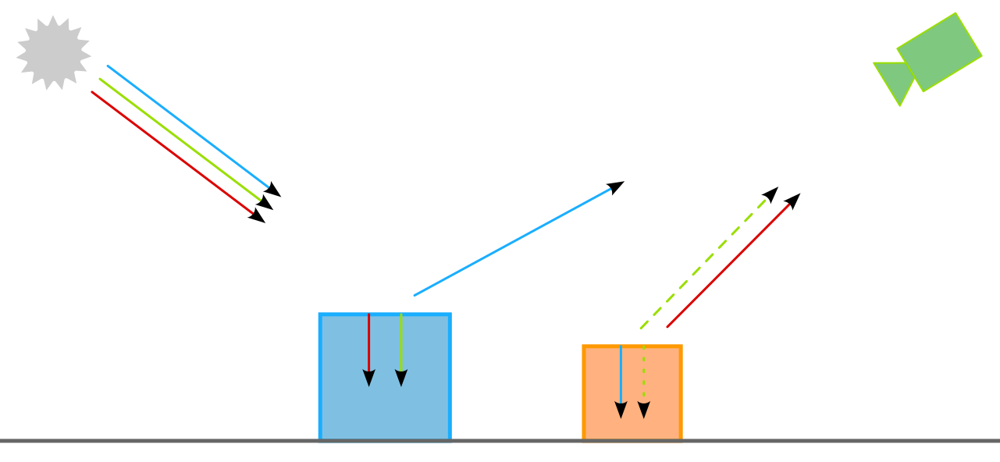

Notes:
- objects *absorb* specific light wavelengths
- the rest is *reflected* to the viewer
- this is perceived object color

--v--

## Light colors

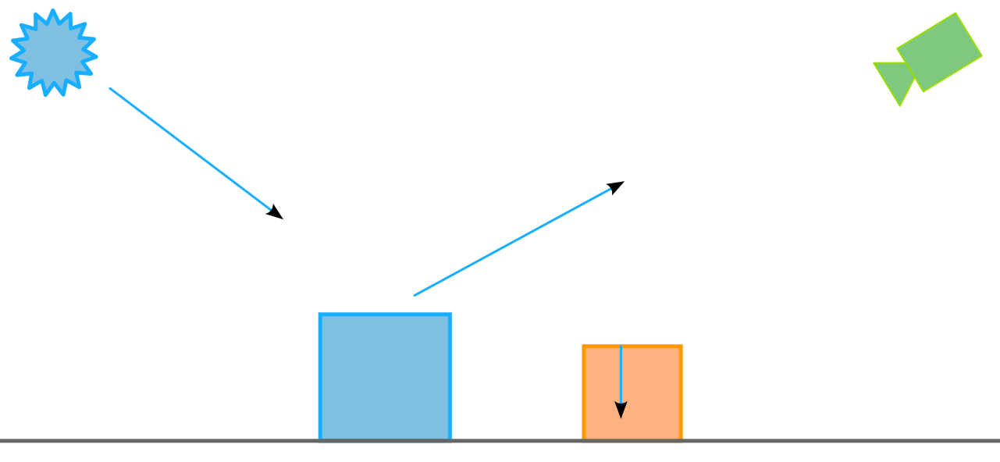

Notes:
- in case of colored lights the idea stays the same
- blue box in blue light is perceived as bright as light (white)
- orange box absorbs all blue light, thus perceived as no light (black)

--v--

## Color math

$$
\underset{visible}{\left\langle r,g,b\right\rangle} = 
\underset{light}{\left\langle r,g,b\right\rangle} \cdot
\underset{object}{\left\langle r,g,b\right\rangle}
$$

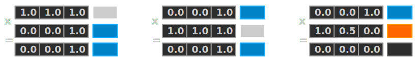

Notes:
- to emulate light absorption we can use vector element-wise multiplication

--s--

## Demo scene setup for shading

Various objects (cube, sphere, monkey, plane).

Indication of light source position (e.g. as a sphere).

Camera controls and GUI (already exists).


Notes:
- flat vs curved surfaces

--v--

## Multiple meshes

```c++
Mesh cube, sphere, monkey, plane;
glm::mat4 cubeMatrix, sphereMatrix, monkeyMatrix, planeMatrix, lampMatrix;
```
```c++
cube = Mesh("assets/meshes/cube.obj");

cubeMatrix = glm::mat4(1.0f);
cubeMatrix = glm::translate(cubeMatrix, {-2.0f, 1.0f, -1.0f});
cubeMatrix = glm::rotate(cubeMatrix, glm::radians(35.0f), {0.0f, 1.0f, 0.0f});
```

```c++
shaderProgram.setMatrix("model", glm::value_ptr(cubeMatrix));
cube.draw();

shaderProgram.setMatrix("model", glm::value_ptr(sphereMatrix));
sphere.draw();
```
Notes: 
- load all meshes
- fill all transformation matrices
- draw all objects
- lamp reuses sphere mesh

--v--

## Multiple shader programs

```c++
shaderProgram = ShaderProgram(
    "assets/shaders/opengl-demo/shading.vert",
    "assets/shaders/opengl-demo/shading.frag");

lampProgram = ShaderProgram(
    "assets/shaders/opengl-demo/shading.vert",
    "assets/shaders/opengl-demo/shading_lamp.frag");
```

```c++
glUseProgram(shaderProgram);
sphere.draw();

...

glUseProgram(lampProgram);
sphere.draw();
```

Notes:
- regular objects use shading 
- lamp use fixed color

--v--

## Vertex shader

```glsl
// shading.vert
#version 450 core

layout(location = 0) in vec3 inPos;

layout(location = 0) uniform mat4 model;
layout(location = 1) uniform mat4 view;
layout(location = 2) uniform mat4 projection;

void main() {
    gl_Position = projection * view * model * vec4(inPos, 1.0);
}
```

--v--

## Fragment shader

```glsl
// shading.frag
#version 450 core

layout(location = 3) uniform vec3 objectColor;
layout(location = 4) uniform vec3 lightColor;

layout(location = 0) out vec4 fragColor;

void main() {
    fragColor = vec4(lightColor * objectColor, 1.0);
}
```

--v--

## Lamp shader

```glsl
// shading_lamp.frag
#version 450 core

layout(location = 4) uniform vec3 lightColor;

layout(location = 0) out vec4 fragColor;

void main() {
    fragColor = vec4(lightColor, 1.0);
}
```

--v--

## Flat colors

<div class="r-stack r-stretch">
    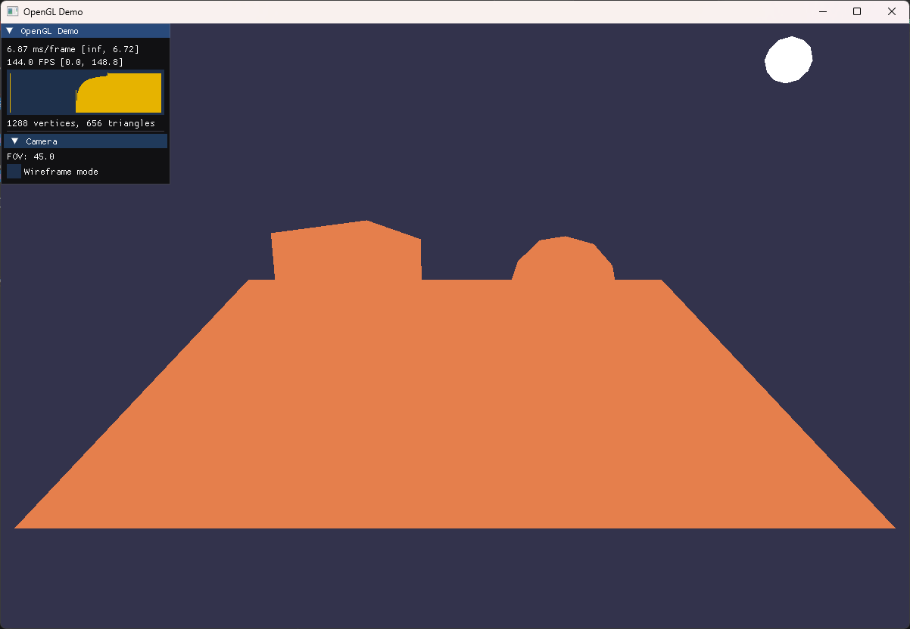
    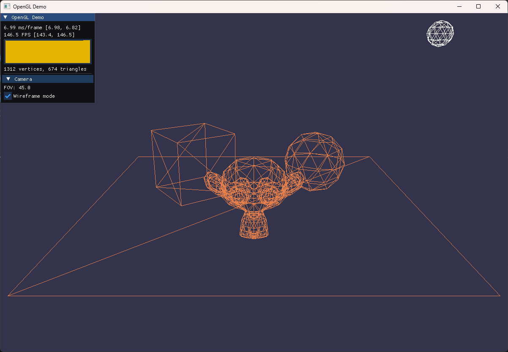
</div>

--s--

## Phong shading

Designed by Bui Tuong Phong in 1970s.

Empirical model of surface illumination.

Combines *ambient*, *diffuse* and *specular* lighting components.

Notes:
- empirical = based on observations, not in math

--v--

## Ambient lighting

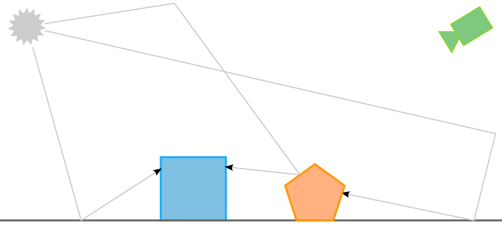

Notes:
- constant light scattered between all objects
- "default" light instead of pitch black darkness

--v--

## Fragment shader

```glsl
#version 450 core

layout(location = 3) uniform vec3 objectColor;
layout(location = 4) uniform vec3 lightColor;

layout(location = 0) out vec4 fragColor;

void main() {
    vec3 ambient = 0.1 * lightColor * objectColor;

    vec3 diffuse = vec3(0);
    vec3 specular = vec3(0);
    fragColor = vec4(ambient + diffuse + specular, 1.0);
}
```
--v--

## Shading progress - ambient

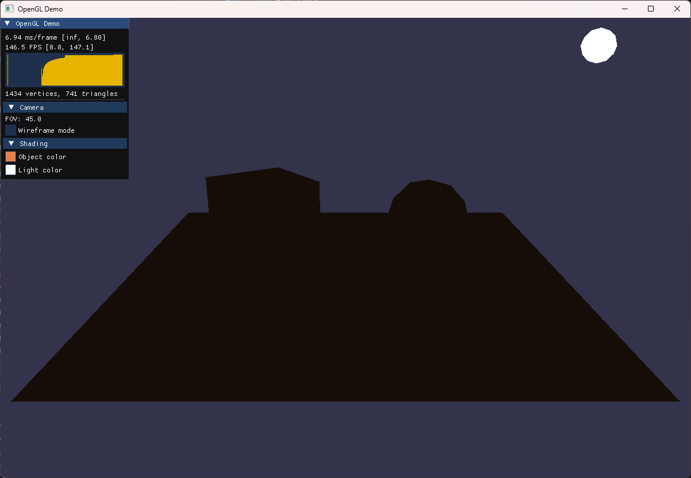
<!-- .element class="r-stretch" -->

--s--

## Diffuse lighting

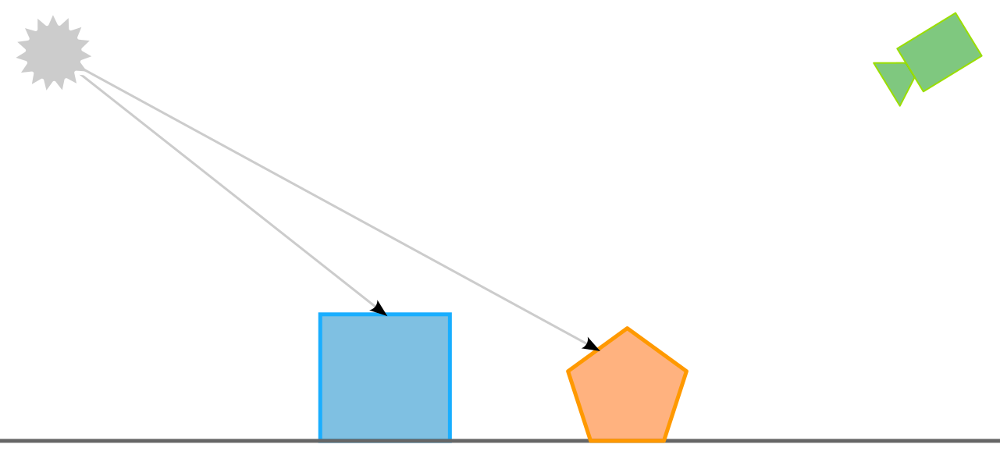

Notes:
- surfaces facing towards light source are illuminated more

--v--

## Diffuse lighting
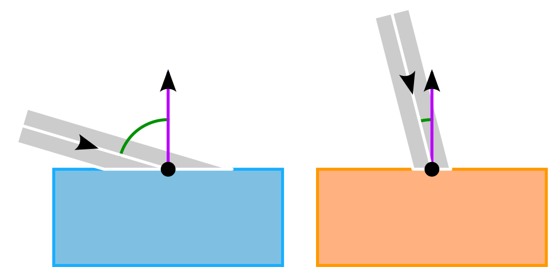

Notes:
- angle between light direction and normal affects brightness of diffuse lighting;
- normal vectors can be loaded from mesh;
- light position can be provided via uniforms;
- pixel position can be calculated from vertex positions;
- world coordinates are easier to use.

--v--

## Loading normals from OBJ file

--cols--

```diff
struct VertexData {
    glm::vec3 pos;
-   glm::vec3 color;
+   glm::vec3 normal;
    glm::vec2 uv;
};
```
--c--

```c++
  for (size_t i = 0; i < mesh->mNumVertices; i++) {
    ...
    if (mesh->mNormals) {
      auto n = mesh->mNormals[i];
      vdata.normal = {n.x, n.y, n.z};
    }
    ...
  }
```

--cols--

--v--

## Vertex shader

```glsl
#version 450 core

layout(location = 0) in vec3 inPos;
layout(location = 1) in vec3 inNormal;
...
layout(location = 0) out vec3 pos;
layout(location = 1) out vec3 normal;

void main() {
    gl_Position = projection * view * model * vec4(inPos, 1.0);
    pos = vec3(model * vec4(inPos, 1.0));
    normal = inNormal;
}
```
Notes:
- `gl_Position` is position for internal OpenGL workings (how to show on screen);
- `pos` is world position for our purposes.

--v--

## Fragment shader

$$a \cdot b = \left\\|a\right\\| \left\\|b\right\\| cos\alpha$$

```glsl
layout(location = 0) in vec3 pos;
layout(location = 1) in vec3 normal;

layout(location = 5) uniform vec3 lightPos;
...

void main() {
    ...
    vec3 normDir = normalize(normal);
    vec3 lightDir = normalize(lightPos - pos);
    float diffuseAmount = max(dot(normDir, lightDir), 0.0);
    vec3 diffuse = diffuseAmount * lightColor * objectColor;    
    ...
}
```
Notes:
- `normalize` transforms vector to unit length;
- `dot` product calculates cosine of angle b/w vectors;
- `diffuseAmount` is in clamped to range [0, 1].

--v--

## Shading progress - diffuse

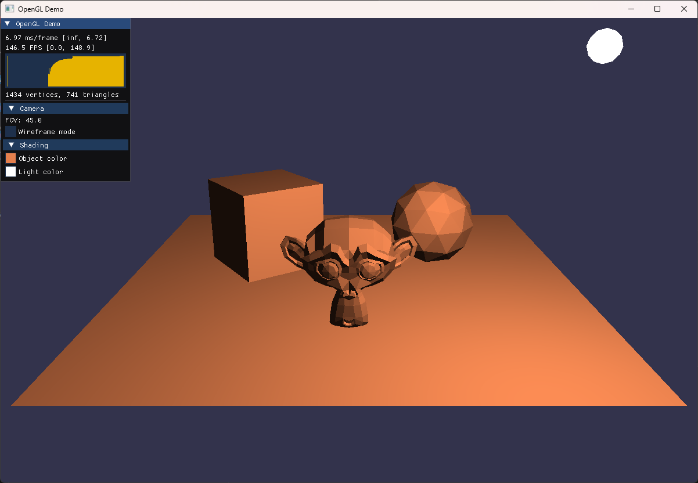
<!-- .element class="r-stretch" -->

--v--

## Non-uniform scaling problem

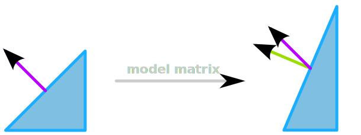

```diff
void main() {
    ...
-   normal = inNormal;
+   normal = mat3(transpose(inverse(model))) * inNormal;
}
```

--s--

## Specular lighting

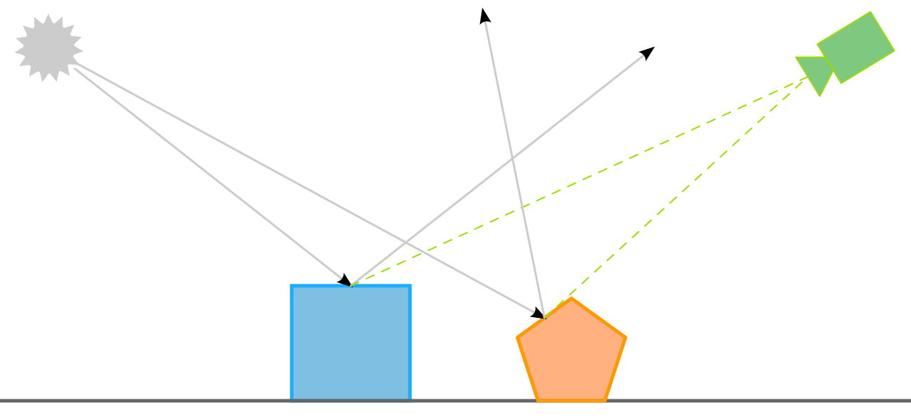

Notes:
- some reflections may get into camera;
- reflections aligned with view line look brighter.

--v--

## Specular lightning

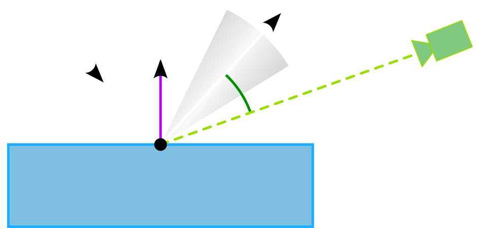

Notes:
- light reflects from the surface around normal vector;
- shininess defines the size of scattering cone;
- angle b/w reflection and view line affects amount of visible specular lighting.

--v--

## Fragment shader

```glsl
layout(location = 6) uniform vec3 cameraPos;
...

void main() {
    ...
    vec3 cameraDir = normalize(cameraPos - pos);
    vec3 reflectDir = reflect(-lightDir, normDir);
    float specularAmount = max(dot(cameraDir, reflectDir), 0.0);
    specularAmount = pow(specularAmount, 32);
    vec3 specular = 0.5 * specularAmount * lightColor * objectColor; 
    ...
}
```

Notes:
- `reflect` needs the vectors pointing towards the surface, thus `-lightDir`;
- `shininess` easier to define via `pow` function.

--v--

## Shading progress - specular

<div class="r-stack r-stretch">
    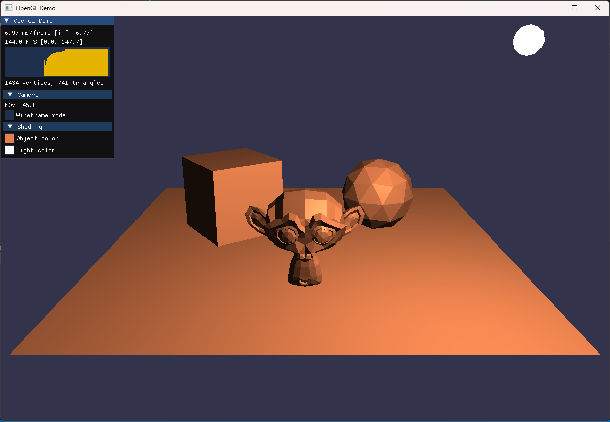
    
</div>

--s--

## Smooth and flat shading

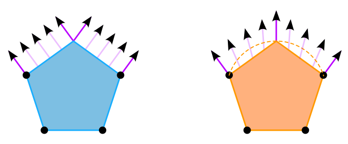

Notes:
- why triangles are still visible?


--v--
## Smooth and flat shading in Blender

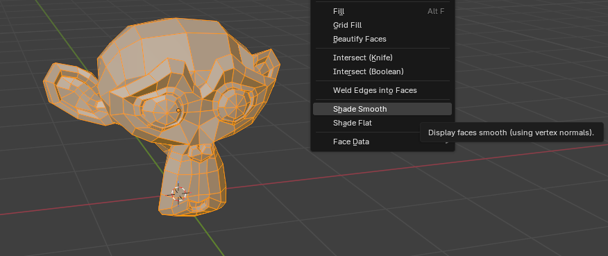

--v--

## Phong shading completed

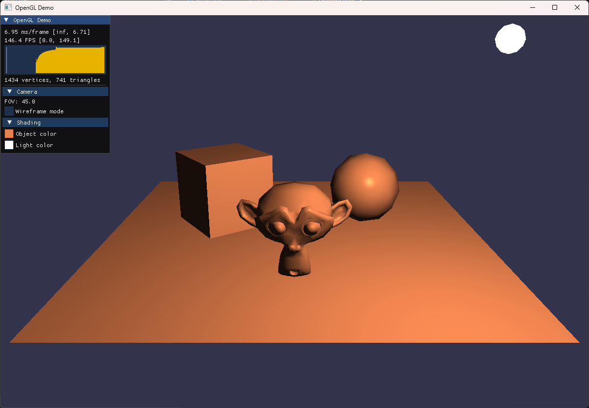
<!-- .element class="r-stretch" -->

--s--

## Hard-coded shading parameters

```glsl [2,12,13]
void main() {
  vec3 ambient = 0.1 * lightColor * objectColor;

  vec3 normDir = normalize(normal);
  vec3 lightDir = normalize(lightPos - pos);
  float diffuseAmount = max(dot(normDir, lightDir), 0.0);
  vec3 diffuse = diffuseAmount * lightColor * objectColor;

  vec3 cameraDir = normalize(cameraPos - pos);
  vec3 reflectDir = reflect(-lightDir, normDir);
  float specularAmount = max(dot(cameraDir, reflectDir), 0.0);
  specularAmount = pow(specularAmount, 32);
  vec3 specular = 0.5 * specularAmount * lightColor * objectColor;

  fragColor = vec4(ambient + diffuse + specular, 1.0);
}
```

--v--

## Light and Material properties (as-is)

| Component | Light              | Material      |
| --------- | ------------------:| -------------:|
| Ambient   | `0.1 * lightColor` | `objectColor` |
| Diffuse   |       `lightColor` | `objectColor` |
| Specular  | `0.5 * lightColor` | `objectColor`<br>`shininess` |

Notes:
- Light source properties
- Object material properties

--v--

## Light and Material properties (to-be)

| Component | Light      | Material  |
| --------- | ----------:| ---------:|
| Ambient   |  `ambient` | `diffuse` |
| Diffuse   |  `diffuse` | `diffuse` |
| Specular  | `specular` | `specular`<br>`shininess` |

Notes:
- we can include coefficients into colors themselves;
- define separate colors for each component;
- usually materials share ambient and diffuse colors, while specular is separate (e.g. clear coat effects)

--v--

## Organizing shading properties

--cols--
```c++
struct Material {
  glm::vec3 diffuse;
  glm::vec3 specular;
  float shininess;
};

struct Light {
  glm::vec3 pos;
  glm::vec3 ambient;
  glm::vec3 diffuse;
  glm::vec3 specular;
};
```
--c--

```c++
Material material = {
    .diffuse = {0.9f, 0.5f, 0.3f},
    .specular = {1.0f, 1.0f, 1.0f},
    .shininess = 32
};

Light light = {
    .pos = {3.0f, 5.0f, 5.0f},
    .ambient = {0.1f, 0.1f, 0.1f},
    .diffuse = {1.0f, 1.0f, 1.0f},
    .specular = {0.5f, 0.5f, 0.5f}
};
```
--cols--

--v--

## Structs to uniforms

```c++
shaderProgram.setVec3("material.diffuse",  glm::value_ptr(material.diffuse));
shaderProgram.setVec3("material.specular", glm::value_ptr(material.specular));
shaderProgram.setFloat("material.shininess", material.shininess);

shaderProgram.setVec3("light.pos",      glm::value_ptr(light.pos));
shaderProgram.setVec3("light.ambient",  glm::value_ptr(light.ambient));
shaderProgram.setVec3("light.diffuse",  glm::value_ptr(light.diffuse));
shaderProgram.setVec3("light.specular", glm::value_ptr(light.specular));
```

--v--

## Fragment shader

```glsl
layout(location = 3) uniform Material material;
layout(location = 6) uniform Light light;

void main() {
    vec3 ambient = light.ambient * material.diffuse;
    ...
    vec3 diffuse = diffuseAmount * light.diffuse * material.diffuse;
    ...
    vec3 specular = specularAmount * light.specular * material.specular;
    ...
}
```

--v--

## Material example

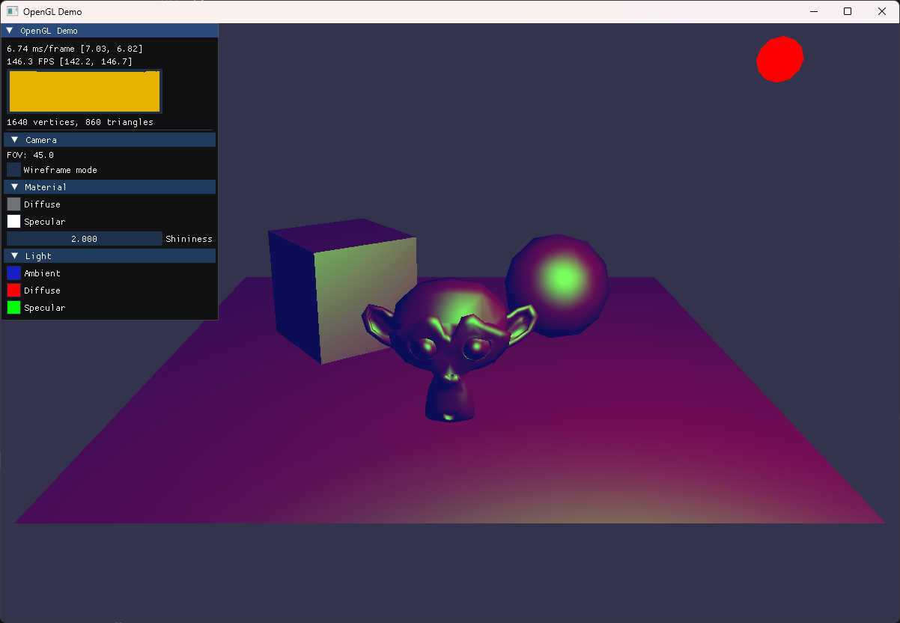
<!-- .element class="r-stretch" -->

--s--

## Multiple materials

```c++
Material cubeMaterial, sphereMaterial, monkeyMaterial, planeMaterial;
```
```c++
cube = Mesh("assets/meshes/cube.obj");
...
cubeMaterial = {.diffuse = {0.66f, 0.27f, 0.14f},
                .specular = {0.7f, 0.7f, 0.7f},
                .shininess = 6};

```

```c++
shaderProgram.setMatrix("model", glm::value_ptr(cubeMatrix));
cubeMaterial.use(shaderProgram);
cube.draw();

shaderProgram.setMatrix("model", glm::value_ptr(sphereMatrix));
sphereMaterial.use(shaderProgram);
sphere.draw();
```

--v--

## Multiple materials example

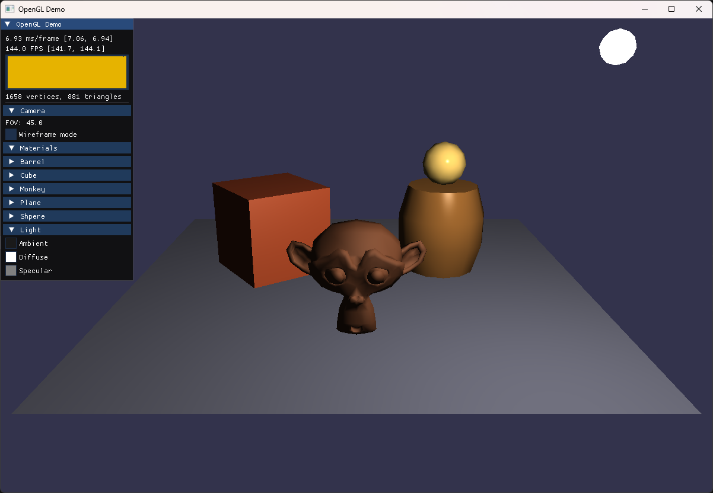
<!-- .element class="r-stretch" -->

Notes:
- each object has its own material;
- but only single color per object.

--s--

## Shading maps

--cols--

```diff
struct Material {
-   glm::vec3 diffuse;  
+   Texture diffuse;
    glm::vec3 specular;
    float shininess;
};
```
--c--

```diff
cubeMaterial = {
-   .diffuse = {0.66f, 0.27f, 0.14f},
+   .diffuse = Texture("box_diffuse.png"),
    .specular = {0.7f, 0.7f, 0.7f},
    .shininess = 6
};
```

--cols--

--v--

## Vertex shader

```glsl
...
layout(location = 2) in vec2 inUV;

...
layout(location = 2) out vec2 uv;

void main() {
  ...
  uv = inUV;
}
```

--v--

## Fragment shader

```glsl
...
layout(location = 2) in vec2 uv;

void main(){
    vec3 ambient = light.ambient 
                        * texture(material.diffuse, uv).rgb;
    ...
    vec3 diffuse = diffuseAmount * light.diffuse 
                        * texture(material.diffuse, uv).rgb;
    ...
}

```
--v--

## Diffuse maps added
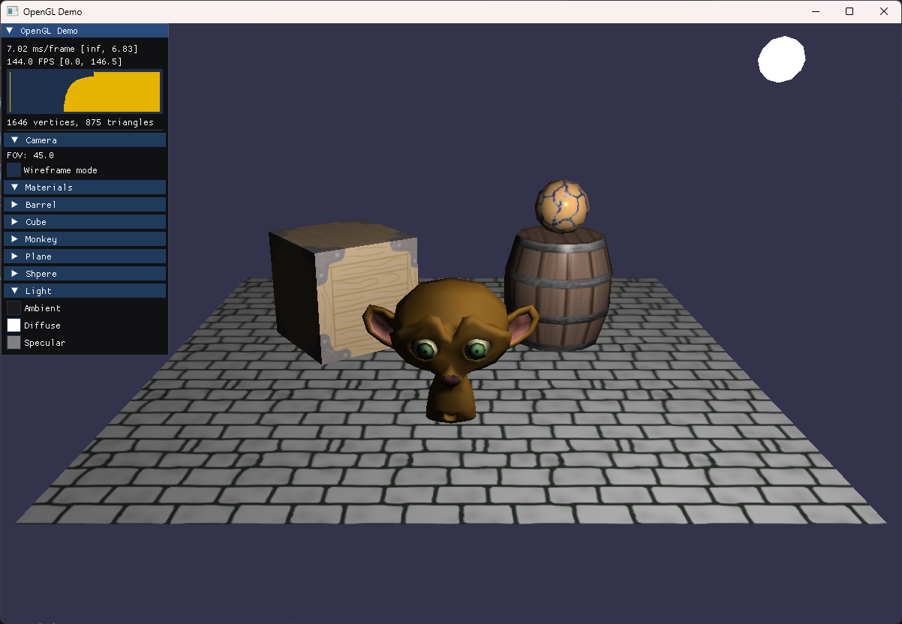
<!-- .element class="r-stretch" -->

--v--

## More shading maps

--cols--

```diff
struct Material {
    Texture diffuse;
-   glm::vec3 specular;
+   Texture specular;
    float shininess;
};
```
--c--

```diff
cubeMaterial = {
    .diffuse = Texture("box_diffuse.png"),
-   .specular = {0.7f, 0.7f, 0.7f},
+   .specular = Texture("box_specular.png"),
    .shininess = 6
};
```

--cols--

--v--

## Diffuse and specular maps added
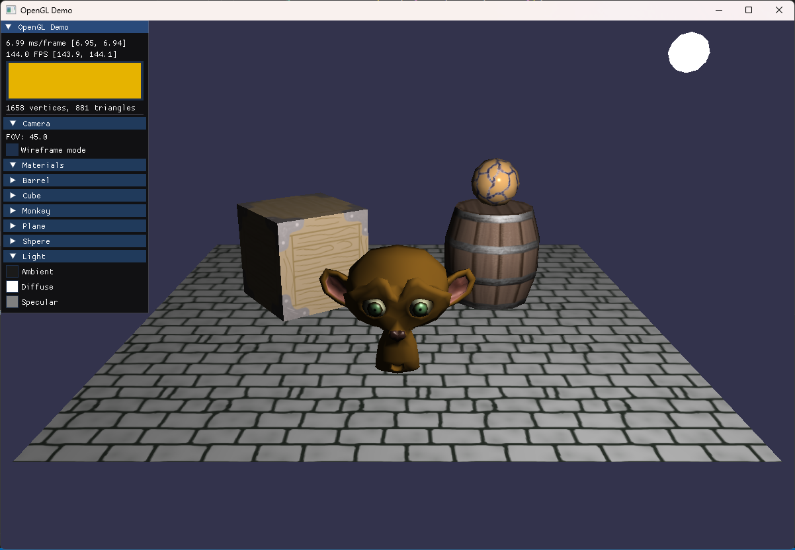
<!-- .element class="r-stretch" -->